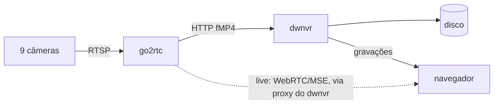

# dwnvr <!-- omit in toc -->


NVR de gravação contínua **projetado com foco em hardware extremamente
limitado**. Ele não é feito para um hardware específico.

O dwnvr vem sendo testado durante todo o seu desenvolvimento em um Orange Pi
Zero 3 (4 cores Cortex-A53, 1,5 GB RAM), gravando 9 câmeras Yoosee 24/7.

**Sem transcodificação de vídeo. Sem banco de dados. Sem decodificar vídeo para
achar movimento.**

Medido nesse Orange Pi Zero 3 com as 9 câmeras gravando simultaneamente:

| | CPU | RAM |
| --- | --- | --- |
| dwnvr | **5% de 1 core** (1% dos 4) | **18 MB** |
| go2rtc | 10% de 1 core | 89 MB |

Com o [detector de objetos](#detecção-de-movimento-e-de-objetos) ligado, que é opcional, nas 9
câmeras e no nível de sensibilidade 5, o mais alto:

| | CPU | RAM |
| --- | --- | --- |
| dwnvr | 5% de 1 core | 29 MB |
| go2rtc | 9% de 1 core | 80 MB |
| dwnvr-detect | 157% de 1 core (39% dos 4) | 229 MB, com picos de 246 MB |

Com a detecção desligada, o dwnvr custa o mesmo que uma versão sem ela.

> **ATENÇÃO:** esse projeto é totalmente vibe codado e é meu primeiro projeto assim. Além de querer resolver uma necessidade minha, que eu acho que é de várias outras pessoas, eu queria saber como seria a experiência de desenvolver totalmente nesse estilo.
>
> Embora seja vibe codado, o projeto já nasceu desde o início com foco em extrema performance, baixíssimo consumo de CPU e memória, tempo de resposta ultra rápido, uma UI super rápida, leve, reativa e responsiva com excelente usabilidade para mobile (browser) e desktop (browser). Parte disso era uma necessidade em razão do hardware real que usei e uso, que é um Orange Pi Zero 3 e tudo isso se constata nos testes que faço e no meu uso no dia a dia. Testei diversas outras opções e nenhuma passou perto dos resultados que tenho, fora outros problemas/chatices diversas.

- [O que você precisa](#o-que-você-precisa)
- [Experimentar em poucos minutos](#experimentar-em-poucos-minutos)
- [Instalar de verdade](#instalar-de-verdade)
- [Detecção de movimento e de objetos](#detecção-de-movimento-e-de-objetos)
- [Atualizar](#atualizar)
- [Casos específicos](#casos-específicos)
- [Como funciona](#como-funciona)
- [Configuração](#configuração)
- [Documentação](#documentação)
- [Desenvolvimento](#desenvolvimento)
  - [Subir a partir do código](#subir-a-partir-do-código)
  - [Tecnologias](#tecnologias)
  - [Estrutura do projeto](#estrutura-do-projeto)
  - [Build](#build)
  - [Testes](#testes)

## O que você precisa

- Linux em **amd64** ou **arm64** (Orange Pi, Raspberry Pi, um PC qualquer);
- **Docker com Compose v2**, ou Podman.

Só isso. Nada é compilado nem instalado na sua máquina: o dwnvr já vem pronto
para rodar. E nem câmera é preciso para experimentar, porque o teste rápido
traz oito câmeras de teste.

## Experimentar em poucos minutos

> Se você já quer instalar para valer, com as suas câmeras, pule para
[instalar de verdade](#instalar-de-verdade).

Sobe o dwnvr com oito câmeras de teste: cinco sintéticas, desenhadas pelo
ffmpeg, e três streams públicos da internet, com imagem de rua de verdade. Tudo
fica dentro do diretório do clone, e apagá-lo desfaz tudo.

```sh
git clone https://github.com/mhagnumdw/dwnvr && cd dwnvr

# Precisam existir antes: se o Docker os criar, eles nascem de root e o
# container - que não roda como root - não consegue escrever dentro deles.
mkdir -p config/dwnvr config/go2rtc storage

# A configuração do dwnvr e a do go2rtc, com as câmeras de teste.
cp dwnvr.example.yaml  config/dwnvr/dwnvr.yaml
cp go2rtc.example.yaml config/go2rtc/go2rtc.yaml

# O container grava com o seu usuário, para os arquivos serem seus no disco,
# e no fuso da sua máquina, para a timeline virar o dia na hora certa.
printf 'DWNVR_UID=%s\nDWNVR_GID=%s\nTZ=%s\n' \
  "$(id -u)" "$(id -g)" "$(timedatectl show -p Timezone --value)" > .env

docker compose up
```

> Com [Podman](#com-podman) no lugar do Docker, o último comando é
`PODMAN_USERNS=keep-id podman-compose --in-pod false up`.

Quando o log disser `dwnvr no ar`, abra <http://localhost:8080>:

1. na aba **Câmeras**, clique na `cam_teste1`, que aparece em *Disponíveis no
   go2rtc* junto com as outras sete - a `cam_teste5` tem áudio, e a
   `traffic`, a `roadcam` e a `accident` são imagem de rua de verdade;
2. a aba **Ao vivo** já mostra a câmera;
3. em ~30s o primeiro trecho fecha e aparece na aba **Gravações**.

Não há tela de login: ela fica desligada até você definir usuário e senha. Isso
é proposital, para o teste rápido não travar numa senha, e vale só para ele: na
[instalação de verdade](#instalar-de-verdade), ligar o login é um dos passos.
Enquanto ele estiver desligado, o dwnvr avisa no log.

> Não há aba **Detecções** porque o teste rápido não sobe o detector de objetos,
> e é ele que traz essa aba. Para ligar a detecção, veja
> [detecção de movimento e de objetos](#detecção-de-movimento-e-de-objetos).

Para desfazer tudo:

```sh
docker compose down
rm -rf config storage .env
```

> Com [Podman](#com-podman) no lugar do Docker, o primeiro comando é
`podman-compose --in-pod false down`.

## Instalar de verdade

É o mesmo `docker-compose.yml` do teste rápido, sem editar uma linha dele: o que
muda é o `.env`, que diz onde as coisas moram no disco. Por isso o `git pull`
da atualização nunca conflita com a sua instalação.

### 1. O código <!-- omit in toc -->

```sh
git clone https://github.com/mhagnumdw/dwnvr && cd dwnvr
```

O clone pode ficar onde você quiser: ele guarda só o `docker-compose.yml` e o
`.env`. A configuração e as gravações moram no diretório do próximo passo. Se
você já clonou para o teste rápido, desfaça o teste e use o mesmo clone.

### 2. Os diretórios <!-- omit in toc -->

Supondo um disco em `/mnt/storage` - troque pelo seu na primeira linha do bloco
de comandos, rodado dentro do clone:

```sh
# O diretório da instalação, no seu disco
DWNVR_DIR=/mnt/storage/dwnvr

sudo mkdir -p "$DWNVR_DIR"/{config/dwnvr,config/go2rtc,recordings}
sudo chown -R "$(id -u):$(id -g)" "$DWNVR_DIR"

cp dwnvr.example.yaml  "$DWNVR_DIR/config/dwnvr/dwnvr.yaml"
cp go2rtc.example.yaml "$DWNVR_DIR/config/go2rtc/go2rtc.yaml"
```

Ficará assim:

```
No Host                                                            No Container
/mnt/storage/dwnvr/
├── config/
│   ├── dwnvr/       dwnvr.yaml, cameras.json, .session-secret  →  /etc/dwnvr
│   └── go2rtc/      go2rtc.yaml: as suas câmeras, com senha    →  /config
└── recordings/      as gravações                               →  /storage
```

Crie-os **antes** de subir, pelo mesmo motivo do teste rápido. Cada serviço
tem a sua subpasta em `config/` de propósito: cada container enxerga só a
própria. As URLs RTSP, com usuário e senha, não ficam visíveis para o dwnvr, e
o segredo de sessão e a senha de login do dwnvr não ficam visíveis para o
go2rtc.

### 3. O `.env` <!-- omit in toc -->

Ao lado do `docker-compose.yml`, no mesmo terminal do passo anterior, que já
tem o `DWNVR_DIR`:

```sh
cat > .env <<EOF
# Onde as coisas moram no host
DWNVR_CONFIG_DIR=$DWNVR_DIR/config/dwnvr
DWNVR_STORAGE_DIR=$DWNVR_DIR/recordings
GO2RTC_CONFIG_DIR=$DWNVR_DIR/config/go2rtc

# O usuário com que o container grava
DWNVR_UID=$(id -u)
DWNVR_GID=$(id -g)

# O fuso da sua máquina, como America/Fortaleza
TZ=$(timedatectl show -p Timezone --value)
EOF

# Confira como ficou
cat .env
```

`DWNVR_UID` e `DWNVR_GID` errados fazem a tela de cadastro falhar ao gravar o
`cameras.json`. O `TZ` decide a que dia cada gravação pertence: errado, a
virada de dia da timeline cai no horário errado.

### 4. As suas câmeras <!-- omit in toc -->

> **Antes:** o dwnvr lê o stream direto da câmera, e muita câmera vem com isso
> desligado. Ative o RTSP (ou ONVIF) na interface web ou no app da câmera.
> Ele costuma ter usuário e senha próprios. Se a sua câmera não tiver RTSP, o
> go2rtc aceita [outras fontes](https://github.com/AlexxIT/go2rtc#module-streams),
> como RTMP, HTTP e protocolos de fabricante.

No `go2rtc.yaml`, apague todas as câmeras de teste e coloque as suas. O bloco
comentado do arquivo traz exemplos: alta e baixa resolução, áudio, o formato
geral da URL RTSP. Depois de subir, elas aparecem sozinhas na aba **Câmeras**,
prontas para cadastrar.

Mexeu no arquivo com tudo já no ar - câmera nova, câmera removida ou só uma
URL trocada? O go2rtc só lê o `go2rtc.yaml` quando sobe, então ele precisa
reiniciar para a mudança valer. A aba **Câmeras** avisa quando percebe a
diferença e tem o botão para reiniciar; `docker compose restart go2rtc` faz o
mesmo. Enquanto isso, as câmeras param de gravar por alguns segundos.

### 5. O login <!-- omit in toc -->

Preencha `server.username` e `server.password` no `dwnvr.yaml`. Enquanto os
dois estiverem vazios, quem abrir a interface enxerga as gravações de todas as
câmeras.

### 6. Subir <!-- omit in toc -->

```sh
docker compose up -d
```

> Com [Podman](#com-podman) no lugar do Docker:
`PODMAN_USERNS=keep-id podman-compose --in-pod false up -d`.

Quando o `docker compose logs dwnvr` disser `dwnvr no ar`, abra
`http://<ip-da-máquina>:8080` no navegador:

1. entre com o usuário e a senha do passo 5;
2. na aba **Câmeras**, clique numa câmera em *Disponíveis no go2rtc*;
3. ajuste nome, cota e o que mais quiser, e clique em **salvar** - ela começa a
   gravar na hora.

Repita o passo 2 para cada câmera.

## Detecção de movimento e de objetos

Opcional, e desligada por padrão. Os passos abaixo partem de uma
[instalação de verdade](#instalar-de-verdade) já no ar. São duas camadas:

- **Movimento** marca na timeline os instantes em que algo mexeu. Não precisa
  de nada além do dwnvr: ligue por câmera, na aba **Câmeras**. Quase não custa
  CPU, porque não decodifica vídeo.
- **Objetos** diz se aquele movimento era pessoa, veículo ou animal. Precisa do
  container `dwnvr-detect`, e custa CPU e RAM de verdade - veja a segunda
  tabela lá no topo.

> **O que esperar da precisão.** O dwnvr foi feito para hardware modesto, e
> toda a detecção roda na CPU, sem acelerador dedicado. Por isso ela não tem a
> precisão de um sistema com hardware especializado: a detecção de movimento,
> em especial, pode marcar o que não interessa e deixar passar algum evento.
> Mesmo assim, a detecção de objetos acerta muito, e impressiona pelo que
> entrega num hardware tão limitado. Usar hardware especializado, como NPU ou
> Coral, pode entrar no futuro.

### Ligar a detecção de movimento <!-- omit in toc -->

Ela é ligada câmera a câmera, e é requisito para o detector de objetos: ele só
olha as câmeras com a detecção de movimento ligada.

1. na aba **Câmeras**, clique em **editar** na câmera - ou ligue já no
   cadastro dela;
2. marque **Marcar movimento na timeline**;
3. escolha a **Sensibilidade**: quanto maior, mais movimento ela pega e mais
   marcas por hora ela gera - a tela mostra quantas. O padrão é o 4;
4. deixe o **Mecanismo** em *estatístico (recomendado)* e clique em **salvar**.

O resultado aparece alguns segundos depois na aba **Gravações**: uma faixa
âmbar na timeline marca os instantes de movimento. Com o detector de objetos,
a timeline ganha também o ícone de pessoa, veículo ou animal, e surge a aba
**Detecções**, com todas elas.

### Ligar o detector de objetos <!-- omit in toc -->

Na pasta do clone:

```sh
# O compose passa a subir o serviço dwnvr-detect junto
echo "COMPOSE_PROFILES=detect" >> .env
```

No `dwnvr.yaml`, descomente:

```yaml
detector:
  url: http://dwnvr-detect:8480
```

E suba de novo. O `restart` faz o dwnvr reler o `dwnvr.yaml`, caso ele já
estivesse no ar:

```sh
docker compose up -d && docker compose restart dwnvr
```

> Com [Podman](#com-podman) no lugar do Docker:
>
> ```sh
> PODMAN_USERNS=keep-id podman-compose --in-pod false up -d \
>   && podman-compose --in-pod false restart dwnvr
> ```

## Atualizar

Atualiza o dwnvr para a versão mais nova - e, junto, o `dwnvr-detect`, se
estiver ligado, e o go2rtc. Na mesma pasta do clone:

```sh
git pull && docker compose up -d --pull always
```

> Com [Podman](#com-podman) no lugar do Docker:
>
> ```sh
> git pull && PODMAN_USERNS=keep-id podman-compose --in-pod false up -d --pull-always
> ```

O `git pull` traz o `docker-compose.yml` novo; o `--pull always` baixa as
imagens novas e recria só os containers que mudaram. A configuração e as
gravações ficam onde estão: o `dwnvr.yaml` e o `go2rtc.yaml` são seus e nenhuma
atualização os reescreve. Para ver se chegou opção nova, compare o seu
`dwnvr.yaml` com o `dwnvr.example.yaml` do clone.

Se o pull falhar, o comando para aí e o que está no ar continua gravando.

## Casos específicos

### Com Podman <!-- omit in toc -->

O mesmo compose sobe com `podman-compose`, desde que o Podman mapeie o seu
usuário para ele mesmo dentro do container:

```sh
PODMAN_USERNS=keep-id podman-compose --in-pod false up
```

Sem o `keep-id`, o Podman rootless faz o seu UID virar root dentro do
container, e o dwnvr, que roda com o `DWNVR_UID`, não consegue ler o
`.session-secret` nem gravar em `config/dwnvr/` e `storage/`. O `--in-pod false` é
porque, dentro de um pod, o `PODMAN_USERNS` é ignorado. As duas opções ficam
fora do `docker-compose.yml` porque o Docker recusa o `keep-id`.

Para derrubar, o `--in-pod false` continua necessário. Sem ele, o
`podman-compose` procura um pod `pod_dwnvr` que nunca foi criado e termina com
`Error: no pod with name or ID pod_dwnvr found`:

```sh
podman-compose --in-pod false down
```

Com SELinux ligado (Fedora, RHEL), o Podman também bloqueia a leitura dos
volumes, e o `:z` que o compose já traz em cada um é o que libera. Nesse caso,
a primeira subida troca o label de todas as gravações que já estiverem no
disco, e pode demorar se forem muitas.

### O go2rtc já roda em outro lugar <!-- omit in toc -->

Se o go2rtc já roda em outro compose ou direto no host, este é o único caso em
que você edita o `docker-compose.yml`:

1. apague o serviço `go2rtc` e o `depends_on: [go2rtc]` do `dwnvr`, e
   descomente o `extra_hosts`;
2. no `dwnvr.yaml`, troque a `go2rtc.url` para `http://host.docker.internal:1984`.

Com o arquivo editado, o `git pull` da atualização pode conflitar: guarde a
edição com `git stash` antes e devolva com `git stash pop` depois.

### Conferir as gravações por fora da interface <!-- omit in toc -->

As gravações ficam no diretório do `DWNVR_STORAGE_DIR` - no teste rápido,
`./storage` -, com o seu usuário:

```sh
# o init, o índice NDJSON e os segmentos
find storage -type f

# Qualquer segmento abre sozinho, sem pré-processamento e sem o init ao lado
ffplay "$(find storage/cam_teste1/2* -name '*.mp4' | head -1)"
```

O dia a dia - arquivos, logs, container sem shell - está em
[`docs/operacao.md`](docs/operacao.md).

## Como funciona



O dwnvr consome o fMP4 que o **go2rtc já produz** (`/api/stream.mp4`) e corta em
segmentos alinhados a keyframe. Ele nunca decodifica, nunca remuxa e nunca toca
nos bytes de mídia - só lê cabeçalhos de caixa para saber onde cortar. É daí que
vêm os 4% de um core.

> **Segmento** é um arquivo de vídeo curto - por padrão ~30s - que toca
> sozinho. A gravação de um dia não é um arquivo gigante: é uma fila de
> segmentos, e é por isso que apagar o mais antigo, pular para um horário
> específico ou exportar um trecho custa quase nada.

**O go2rtc fica fora do escopo.** Configurá-lo é responsabilidade de quem
instala; o dwnvr apenas descobre os streams existentes via `/api/streams` e
recomenda configuração.

> Talvez no futuro o dwnvr faça a configuração automática
do go2rtc, mas por enquanto não.

O porquê de cada decisão de formato está em
[`docs/arquitetura.md`](docs/arquitetura.md).

**A detecção é opcional**, e vem desligada. Ligada numa câmera, ela marca na
timeline os instantes de movimento, calculados do tamanho dos quadros - de novo
sem decodificar nada. Com o container `dwnvr-detect`, ela diz também se era
pessoa, veículo ou animal. Como funciona e quanto custa, em
[`docs/deteccao.md`](docs/deteccao.md).

## Configuração

Dois arquivos, de propósito:

- **`dwnvr.yaml`** - infraestrutura, editado à mão, **nunca reescrito** pela
  aplicação. Veja [`dwnvr.example.yaml`](dwnvr.example.yaml).
- **`cameras.json`** - a lista de câmeras, gravada pela tela de cadastro.

Estão separados porque têm ciclos de vida diferentes: a infraestrutura é
editada à mão e quase nunca muda; a lista de câmeras é gravada pela aplicação a
cada clique. Num arquivo só, o dwnvr teria que reescrever, várias vezes por dia,
um arquivo que alguém pode ter aberto no editor naquele instante - apagando no
caminho os comentários que essa pessoa escreveu. Do jeito que está, um erro na
tela de cadastro ou uma queda de energia no meio dela não alcançam a
configuração do serviço.

Tudo que é política de gravação é **por câmera**: qual stream do go2rtc usar
(alta ou baixa resolução), áudio, cota, tamanho do segmento, o limiar de
inatividade e a detecção - ligada ou não, o mecanismo e o nível de
sensibilidade, de 1 a 5. Detalhes, incluindo o custo de cada modo de áudio em
CPU e disco, em [`docs/configuracao.md`](docs/configuracao.md).

O detector de objetos é opcional: um container à parte, `dwnvr-detect`,
apontado por `detector.url` no `dwnvr.yaml`. Sem ele, a detecção marca só
movimento.

## Documentação

| Documento | Para quê |
|---|---|
| [`docs/operacao.md`](docs/operacao.md) | o dia a dia: arquivos, logs, container sem shell |
| [`docs/configuracao.md`](docs/configuracao.md) | os dois arquivos, política por câmera, retenção, áudio |
| [`docs/arquitetura.md`](docs/arquitetura.md) | o formato em disco e por que ele é assim |
| [`docs/deteccao.md`](docs/deteccao.md) | a detecção de movimento e de objetos: o fluxo, o custo e os limites |
| [`docs/resiliencia.md`](docs/resiliencia.md) | queda de energia e o go2rtc que emudece sem avisar |
| [`docs/api.md`](docs/api.md) | referência dos endpoints HTTP |
| [`web/README.md`](web/README.md) | desenvolver a interface |
| [`docs/README.md`](docs/README.md) | índice completo, incluindo as medições datadas |

## Desenvolvimento

O que vem daqui para baixo é para quem vai mexer no código. Para usar o dwnvr,
as seções do topo bastam.

### Subir a partir do código

O `docker-compose.yml` usa as imagens publicadas. Para subir o que está no seu
clone, some o `docker-compose.build.yml`, que compila as duas imagens com a
tag local `:dev`:

```sh
docker compose -f docker-compose.yml -f docker-compose.build.yml up --build
```

A primeira compilação leva alguns minutos; as seguintes reaproveitam o cache.

### Tecnologias

| O quê | Onde entra |
| --- | --- |
| **Go 1.27** | Todo o servidor. Só a biblioteca padrão, **sem [cgo](https://pkg.go.dev/cmd/cgo)** - o binário é estático, de ~8 MB |
| **go2rtc** | Fonte dos streams: fala RTSP com as câmeras e entrega fMP4, WebRTC e MJPEG |
| **fMP4** (MP4 fragmentado) | O formato em disco. É o que o go2rtc já produz, então gravar é copiar bytes |
| **NDJSON** | O índice das gravações, um arquivo por câmera por dia, append-only |
| **Svelte 5 + Vite** | A interface, embutida no binário com `go:embed` |
| **MSE** (Media Source Extensions) | Player das gravações, escrito à mão para não carregar [hls.js](https://github.com/video-dev/hls.js/) |
| **Docker** | Imagem `FROM scratch` multi-arch, para `linux/arm64` e `linux/amd64` |
| **dwnvr-detect** (opcional) | O detector de objetos: Python, PyAV e onnxruntime rodando o RF-DETR nano (Apache-2.0) a 512x288 em int8 |

A única dependência Go do projeto é `go.yaml.in/yaml/v3`. Não há banco de dados,
ORM, framework HTTP nem ffmpeg - e essa ausência é o projeto, não uma etapa que
faltou. O que exige código nativo, decodificar vídeo e rodar um modelo de
visão, mora fora do binário, no container opcional `dwnvr-detect`.

### Estrutura do projeto

```
├── cmd/
│   └── dwnvr/              o binário: lê a config, sobe um recorder por câmera, serve HTTP
├── internal/
│   ├── api/                servidor HTTP
│   │   ├── server.go       rotas e o que exige sessão
│   │   ├── auth.go         sessão por cookie assinado (HMAC), sem estado no servidor
│   │   ├── cameras.go      cadastro de câmeras, cruzado com os streams do go2rtc
│   │   ├── probe.go        descobre se um stream ocioso entrega áudio, com cache
│   │   ├── recordings.go   dias, timeline, init, segmentos, thumbnail, HLS, exportação
│   │   ├── deteccoes.go    as detecções de todas as câmeras, paginadas, e o quadro de cada uma
│   │   ├── live.go         proxy do go2rtc, com a credencial ficando no servidor
│   │   ├── diagnostico_servidor.go  a máquina que grava, para o Diagnóstico: temperatura, memória, storage, go2rtc
│   │   ├── web.go          serve a SPA embutida
│   │   └── dist/           build da interface, versionado (ver web/README.md)
│   ├── buildinfo/          versão, commit e data injetados no build
│   ├── config/             leitura do dwnvr.yaml (infra) e do cameras.json (câmeras)
│   ├── detect/             a detecção: do tamanho dos quadros à marca de objeto
│   ├── fmp4/               leitor de caixas MP4 - o coração do "sem decodificar"
│   │   ├── box.go          percorre as caixas sem tocar em mídia
│   │   ├── moov.go         lê o init segment (ftyp+moov) e suas trilhas
│   │   ├── fragment.go     lê moof+mdat e descobre quais frames são keyframe
│   │   ├── rebase.go       reescreve o tfdt para cada segmento começar do zero
│   │   ├── probe.go        hash do init e sondagem de segmento órfão
│   │   └── sps.go          resolução real a partir do SPS de H264/H265
│   ├── go2rtc/             cliente da API do go2rtc e do stream fMP4
│   ├── logbuf/             guarda em memória os últimos avisos e erros do log, para o Diagnóstico
│   ├── recorder/           um recorder por câmera: corta em keyframe e grava
│   ├── retention/          apaga o mais antigo quando cota, idade ou disco estouram
│   └── store/              layout em disco e índice NDJSON
├── dwnvr-detect/           o detector de objetos, opcional, num container à parte (ver dwnvr-detect/README.md)
├── web/                    interface Svelte 5 + Vite (ver web/README.md)
├── docs/                   documentação longa (ver docs/README.md)
├── docker-compose.yml      dwnvr + go2rtc (+ dwnvr-detect, opcional), o único arquivo para subir tudo
├── Dockerfile              imagem FROM scratch, multi-arch
├── dwnvr.example.yaml      configuração do dwnvr, campo a campo
├── go2rtc.example.yaml     configuração do go2rtc, com as câmeras de teste
└── Makefile                build, testes e deploy
```

<details>
<summary><b>Por que as pastas se chamam assim</b></summary>

Alguns nomes acima não são escolha deste projeto. Uns são **convenção da
comunidade Go** - você pode ignorá-los e nada quebra, só fica estranho para
quem lê. Outros são **exigência do Go**: mudar o nome faz o build falhar.
Resumo antes do detalhe:

| Caminho | O que é | Se você renomear |
|---|---|---|
| `cmd/` | convenção da comunidade | compila igual, só surpreende quem lê |
| `internal/` | **exigência do Go** | o pacote passa a ser importável por qualquer projeto |
| `internal/api/dist/` | escolha nossa, **imposta pelo `go:embed`** | o build quebra |
| `web/src/vendor/` | convenção, e do lado JavaScript | nada acontece |
| `*_test.go` | **exigência do Go** | o arquivo passa a entrar no binário final |

#### `cmd/` - convenção da comunidade <!-- omit in toc -->

Não é invenção deste projeto nem exigência do compilador: é o hábito adotado em
praticamente todo projeto Go de porte - Kubernetes, Docker, Prometheus, o
próprio go2rtc.

A regra é simples: **cada subdiretório de `cmd/` vira um binário**, e é o único
lugar onde mora `package main`. O nome do subdiretório é o nome do executável -
`cmd/dwnvr` produz `dwnvr`. Aqui só existe uma pasta porque só existe um
binário; um segundo executável seria uma pasta irmã, sem reorganizar mais nada.

O que a convenção compra: `main` fica magro - lê configuração, monta as peças e
sai da frente, com toda a lógica em pacotes testáveis sob `internal/`;
`go build ./cmd/dwnvr` fica inequívoco, sem caçar qual arquivo tem a função
`main`; e acrescentar um segundo binário não reorganiza nada.

#### `internal/` - exigência do Go <!-- omit in toc -->

Aqui não é hábito, é regra que o próprio Go impõe. Um pacote sob `internal/` só
pode ser importado de dentro do próprio módulo. Outro projeto que tente
importar `github.com/mhagnumdw/dwnvr/internal/store` recebe:

```
use of internal package github.com/mhagnumdw/dwnvr/internal/store not allowed
```

É o que permite reorganizar tudo que está aqui dentro sem quebrar ninguém lá
fora: nada disto é API pública, e o Go garante isso em vez de pedir por favor.

#### `internal/api/dist/` - o build da interface, versionado <!-- omit in toc -->

Commitar artefato gerado costuma ser sinal de desleixo. Aqui é deliberado, e
duas restrições explicam o formato.

**Por que está versionado:** `go:embed` exige que os arquivos existam em tempo
de compilação. Com o `dist` no repositório, `go build ./cmd/dwnvr` funciona num
clone limpo, sem Node instalado - o que importa porque o alvo é um dispositivo
onde ninguém quer instalar toolchain de frontend.

**Por que fica dentro de `internal/api/`, e não em `web/dist/`:** o `go:embed`
não consegue sair do diretório do pacote. Um `//go:embed ../web/dist` não
compila:

```
pattern ../web/dist: invalid pattern syntax
```

Por isso o `vite.config.js` manda o build para `../internal/api/dist`, ao lado
do `web.go` que o embute. Ao mexer em `web/`, rode `npm run build` **antes** de
commitar - a CI reprova se os dois divergirem.

#### `web/src/vendor/` - convenção, e do outro lado da cerca <!-- omit in toc -->

Guarda código de terceiros: o player de live do go2rtc (MIT), copiado sem
modificação. Ver [`web/src/vendor/README.md`](web/src/vendor/README.md).

Uma armadilha de leitura: em Go, um diretório `vendor/` **na raiz do módulo** é
especial - é onde `go mod vendor` despeja as dependências, e a partir daí o
build passa a usá-las em vez do cache de módulos. Este `vendor/` não é aquele:
está dentro de `web/`, é JavaScript, e para o Go não significa nada. O nome foi
emprestado pelo costume, não pela regra.

#### `*_test.go` - exigência do Go <!-- omit in toc -->

O sufixo não é estilo: **o Go só compila esses arquivos durante `go test`**.
Eles ficam de fora do binário final, o que permite deixá-los ao lado do código
que exercitam sem inchar o que vai para produção - e é por isso que aqui não
existe uma pasta `tests/` separada.

A parte que é convenção: mantê-los no **mesmo pacote** do código testado, o que
dá acesso ao que não é exportado.

Referências: [Organizing a Go module](https://go.dev/doc/modules/layout),
[go/build - build constraints](https://pkg.go.dev/go/build#hdr-Build_Constraints)
e [golang-standards/project-layout](https://github.com/golang-standards/project-layout).

</details>

### Build

```sh
make all         # interface + binário local, na ordem certa
make help        # lista todos os alvos
```

**A interface precisa ser construída antes do binário**, porque o Go a embute
com `go:embed`. Esquecer isso produz um binário que compila e sobe
normalmente, mas serve a tela antiga - um erro silencioso. O `Makefile`
encadeia as duas coisas, e a CI reprova se o `internal/api/dist` versionado
divergir de `web/`.

| Alvo | O que faz |
|---|---|
| `make web` | constrói a interface para `internal/api/dist` (precisa de Node) |
| `make build` | binário para a máquina local |
| `make image-arm64` | imagem docker arm64, carregada no docker local |
| `make image-amd64` | imagem docker amd64, carregada no docker local |
| `make image` | imagem multi-arch (amd64 + arm64), como a que a CI publica |
| `make deploy` | recria o container no servidor remoto via ssh, com a imagem que a CI publicou |
| `make deploy-wip` | leva o código **não commitado** para o servidor, só para experimentar |

Como o `internal/api/dist` é versionado, **`go build ./cmd/dwnvr` funciona num
clone limpo sem Node instalado**. Isso é deliberado: o alvo é um dispositivo
onde ninguém quer instalar toolchain de frontend.

### Testes

```sh
make test        # testes de unidade
make check       # testes + gofmt + go vet
```

A CI roda isso e mais uma coisa: reconstrói a interface para conferir se o
`internal/api/dist` versionado ainda corresponde a `web/`. Fica fora do `make
check` porque exigiria Node em toda máquina que só quer compilar o Go.

Os testes vivem ao lado do código que exercitam, em `internal/*/*_test.go`, e
cobrem o que quebra em silêncio: a leitura de caixas fMP4, a reescrita do
`tfdt`, o corte em keyframe, a reconciliação de órfãos, a retenção e os
endpoints HTTP.

O workflow de CI está em `.github/workflows/ci.yml` e roda a cada push.
