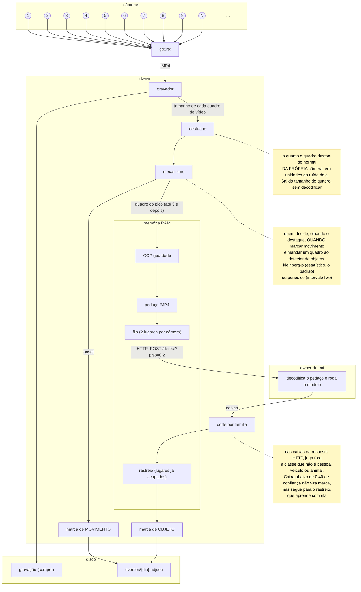

# A detecção de movimento e de objetos <!-- omit in toc -->

A detecção põe na timeline duas coisas que a gravação sozinha não diz: **quando**
houve movimento e, com o detector de objetos, **o que** era (pessoa, veículo ou
animal). Ela é opcional e vem desligada. Quem só grava não paga nada por ela.

Como ligar e configurar está em [`configuracao.md`](configuracao.md). Aqui fica
como ela funciona por dentro, e por quê.

- [O que ela faz, e o que não faz](#o-que-ela-faz-e-o-que-não-faz)
- [O vocabulário](#o-vocabulário)
- [O caminho de um quadro até a marca](#o-caminho-de-um-quadro-até-a-marca)
- [O dwnvr-detect](#o-dwnvr-detect)
- [Carro parado não vira marca a cada olhada](#carro-parado-não-vira-marca-a-cada-olhada)
- [Os parâmetros, e onde eles moram](#os-parâmetros-e-onde-eles-moram)
- [O custo](#o-custo)
- [Quando o dwnvr-detect cai](#quando-o-dwnvr-detect-cai)
- [Os limites do modelo](#os-limites-do-modelo)
- [Onde está no código](#onde-está-no-código)

## O que ela faz, e o que não faz

**Faz:**

- marca na timeline os instantes de movimento, numa faixa de calor âmbar
- com o `dwnvr-detect`, marca a **chegada** de pessoa, veículo ou animal, com
  ícone na timeline e caixa sobre o vídeo
- mostra no Diagnóstico o que aconteceu com cada movimento marcado (o funil) e
  como está a fila do detector

**Não faz:**

- **não grava por movimento.** A gravação continua contínua; a detecção só
  anota por cima dela
- **não decodifica vídeo no dwnvr.** O movimento sai do tamanho dos quadros, e
  quem decodifica é o `dwnvr-detect`, num container à parte
- **não olha todo quadro.** O detector de objetos olha um quadro por movimento
  marcado, não um fluxo contínuo
- **não avisa ninguém.** Não há notificação nem alarme: é uma marca na timeline
- **não reconhece rosto nem placa**, e não aprende com a sua casa. O modelo é
  um só, com as 80 classes do COCO, e o dwnvr usa 12 delas

## O vocabulário

| Termo | O que é |
|---|---|
| **destaque** (score) | o quanto um quadro destoa do normal DA PRÓPRIA câmera, em unidades do ruído dela. Sai do tamanho do quadro, sem decodificar |
| **mecanismo** | quem decide QUANDO disparar, olhando o destaque. `kleinberg-p` (estatístico, o padrão) ou `periodico` (intervalo fixo) |
| **onset** | o instante em que o mecanismo dispara. Vira uma marca de movimento, e é o instante que a timeline mostra |
| **sensibilidade** | o nível de 1 a 5. É o **custo**: quantos onsets por hora cada câmera gera |
| **pico** | o quadro de maior destaque nos 3 s depois do onset. É ele que o detector olha, porque no onset o objeto ainda está entrando pela metade |
| **pedaço** | o trecho de vídeo que vai ao detector: do frame I do GOP até o quadro do pico |
| **olhada** | uma ida ao `dwnvr-detect` com um pedaço, e a resposta dele |
| **família** | `pessoa`, `veiculo` ou `animal`: o agrupamento das classes do modelo que a timeline colore. A prioridade é nessa ordem |
| **chegada** | um objeto aparecendo onde antes não havia. É o que a marca de objeto registra - não a presença |
| **rastreio** | a memória, por câmera, dos lugares já ocupados por objeto parado |
| **funil** | o destino de cada onset: descartado, olhado sem novidade, com objeto, ainda em andamento ou sem resposta |

## O caminho de um quadro até a marca



1. **O tamanho do quadro.** O gravador já tem na mão o tamanho de cada quadro
   de vídeo, que é o que ele escreve em disco. Nenhum pixel é decodificado.
   Quadro que carrega mais informação que o normal é quadro em que algo mudou.
2. **O destaque.** O `kleinberg-p` compara esse tamanho com a média e o desvio
   recentes da própria câmera, e esconde o frame I, que é dezenas de vezes
   maior que os outros e afogaria o sinal. É por comparar cada câmera com ela
   mesma que o mesmo nível de sensibilidade vale igual numa câmera quieta e
   numa cheia de ruído de infravermelho.
3. **O onset.** Quando o destaque passa do limiar do nível, o mecanismo
   dispara. Uma histerese (um limiar para abrir, outro mais baixo para fechar)
   impede que uma pessoa atravessando a cena vire vinte marcas. O onset vai
   para `eventos/{dia}.ndjson` como marca de movimento, **com ou sem olhada**.
4. **O pico e o pedaço.** O mecanismo espera até 3 s pelo quadro de maior
   destaque, e o dwnvr corta o pedaço do frame I até ele, a partir do GOP que
   guarda em memória para cada câmera com detecção.
5. **A fila.** Uma só para todas as câmeras, com dois lugares por câmera. Se a
   câmera já tem dois pedaços esperando, o novo é **descartado**: fica só como
   movimento. É o que impede a câmera mais agitada de tomar a vez das outras.
6. **A olhada.** O `dwnvr-detect` decodifica o pedaço, roda o modelo no último
   quadro e devolve as caixas.
7. **A marca de objeto.** O dwnvr descarta classe fora das famílias, aplica o
   corte de confiança e o rastreio, e grava no máximo uma marca por família,
   no instante do onset.

Todo objeto tem um movimento embaixo, mas nem todo movimento tem objeto.

## O dwnvr-detect

Um endpoint HTTP **sem estado**: recebe um pedaço, devolve as caixas do último
quadro. Não tem fila, não tem memória e não decide o que vira marca. Detalhes
de build, modelo e licença em [`dwnvr-detect/README.md`](../dwnvr-detect/README.md).

```
POST /detect?piso=0.2     Content-Type: video/mp4, corpo: o pedaço
GET  /health              só o HEALTHCHECK do Docker; o dwnvr não chama
```

```json
{
  "achados": [
    {
      "classe": "person",
      "score": 0.87,
      "caixa": [0.41, 0.32, 0.47, 0.62]
    }
  ],
  "quadrosDecodificados": 14,
  "largura": 640,
  "altura": 360,
  "tempoMs": {
    "decodifica": 181.3,
    "preparo": 42.7,
    "modelo": 3391.5
  }
}
```

- **`caixa` é `[x1, y1, x2, y2]` em fração do quadro**, e não em pixels: é a
  única forma que continua valendo quando a resolução da câmera muda.
- **O `piso`** é a menor confiança que ele devolve, de qualquer classe. O dwnvr
  manda 0,20, bem abaixo do corte de 0,40, porque o rastreio aprende também com
  caixa fraca.
- **Um pedido por vez**, de propósito: numa placa de 4 núcleos que também
  grava, duas olhadas em paralelo seriam o dobro da RAM de pico sem uma
  resposta a mais por segundo. Quem enfileira é o dwnvr.
- **Pedaço que não decodifica até o fim volta `422`**: olhar o último quadro
  que sobrou seria olhar outro instante.

**Por que a divisão é exatamente aí:**

| Tarefa | Quem |
|---|---|
| gravar, calcular o destaque, disparar o onset, achar o pico | dwnvr |
| guardar o GOP e cortar o pedaço | dwnvr |
| a fila: ordem, limite por câmera, descarte, timeout, pausa | dwnvr |
| **decodificar o pedaço e rodar o modelo** | dwnvr-detect |
| corte por família, rastreio, gravar a marca | dwnvr |

1. **O sidecar tem só o que exige código nativo** - decodificador de vídeo e
   runtime do modelo. O dwnvr continua Go puro, numa imagem de 8 MB.
2. **Todo estado fica no dwnvr.** O sidecar pode reiniciar a qualquer momento
   sem produzir marca falsa.
3. **Por que Python, e não Go.** Quem roda o modelo é o onnxruntime, em C++, e
   a RAM é do modelo, não da linguagem: em Go e em Python a olhada levou o
   mesmo tempo. Em Python o sidecar usa as mesmas bibliotecas que exportaram o
   modelo, e dá as mesmas caixas por construção.

## Carro parado não vira marca a cada olhada

O detector não sabe o que é "novo": o carro estacionado aparece em toda olhada
daquela câmera, e marcaria dezenas de vezes por dia. O **rastreio**
(`internal/detect/marcador.go`) lembra, por câmera e por família, onde já há
objeto. Para cada caixa, a cada olhada:

| A caixa | O que acontece |
|---|---|
| cai num lugar **já ocupado** (mesma família, sobreposição IoU de pelo menos 0,7) | **não marca**, só confirma o lugar |
| cai num lugar **livre**, com confiança de pelo menos 0,40 | **marca**, e passa a ocupar o lugar |
| cai num lugar livre, com confiança entre 0,20 e 0,40 | não marca, mas **ocupa** o lugar |
| um lugar fica **5 olhadas seguidas** sem aparecer | o lugar é **liberado** |

O carro chega e marca uma vez. Fica parado sem marcar. Sai, e o lugar é
liberado depois de 5 olhadas. Volta, e marca de novo.

- **Por que caixa fraca ocupa lugar:** o detector "pisca". Um objeto parado
  passa do corte em alguns quadros e não em outros; se só o que passa do corte
  ocupasse o lugar, cada piscada viraria uma chegada nova.
- **Olhada que falhou não conta como falta.** Falta é "olhei e não vi"; falha é
  "não olhei". Senão, uns minutos com o sidecar fora liberariam todos os
  lugares, e o carro parado seria marcado de novo quando ele voltasse.
- **O preço:** se o carro sai e volta com menos de 5 olhadas no meio, a volta
  não marca (ver
  [`TODO_olhada-forcada-sem-onset.md`](TODO/TODO_olhada-forcada-sem-onset.md)).
  E a memória não sobrevive a um reinício: depois dele, cada objeto parado
  aparece uma vez como se tivesse acabado de chegar.

## Os parâmetros, e onde eles moram

**O que o usuário escolhe** - ver [`configuracao.md`](configuracao.md):

| Onde | O quê |
|---|---|
| `cameras.json`, pela tela de Câmeras | `detect`, `detectMecanismo`, `detectSensibilidade` |
| `dwnvr.yaml` | `defaults` desses três, e `detector.url` |
| env do `dwnvr-detect` | `DETECT_THREADS`, `DETECT_MODELO`, `DETECT_PORTA` |

**O que é medido**, fixo em
[`internal/detect/parametros.go`](../internal/detect/parametros.go). Cada
número tem ao lado o porquê dele. Não são preferência, e mudar um sem medir de
novo faz a medição deixar de valer em silêncio:

| Número | Valor | O que é |
|---|---|---|
| `OnsetsPorHora` | 6, 12, 25, 50, 100 | o custo de cada nível, por câmera |
| `LimiarKleinbergP` | um por nível | o limiar que faz o `kleinberg-p` custar exatamente o que o nível manda |
| `JanelaDoPicoMs` | 3 s | onde procurar o quadro a olhar depois do onset |
| `CorteDaFamilia` | 0,40 | a confiança a partir da qual uma caixa pode virar marca |
| `PisoDoDetector` | 0,20 | a menor confiança que o sidecar devolve |
| `IoUDoMesmoLugar` | 0,7 | a sobreposição que faz duas caixas serem o mesmo lugar |
| `FaltasParaLiberar` | 5 | olhadas sem ver que liberam um lugar |
| `PedacosPorCamera` | 2 | os lugares de cada câmera na fila |
| `PrazoDaOlhadaMs` | 60 s | quanto a fila espera uma resposta |
| `PausaDepoisDeFalhaMs` | 30 s | a pausa da fila depois de uma olhada que falhou |
| `TetoDoGOPBytes` | 4 MB | o maior GOP guardado por câmera; freio de RAM |
| `FamiliasPadrao` | 12 classes | quais classes do COCO viram `pessoa`, `veiculo` ou `animal` |

## O custo

**Desligada, quase nada.** Numa câmera com `detect` desligado, o mecanismo não
existe, o GOP não é guardado e nenhum pedido sai: sobra, por quadro, uma troca
atômica e um `if`. Sem `detector.url`, a fila nem nasce. O `docker-compose.yml`
só sobe o `dwnvr-detect` com o profile `detect`, e quem não o liga não baixa
nem a imagem. Na interface, a timeline não pede marcas de câmera sem detecção,
e o código das caixas vem num arquivo à parte, que só baixa quando o dia tem
objeto.

**Ligada, o custo é o nível de sensibilidade, e ele é POR CÂMERA.** Com dez
câmeras no nível 4 são 500 olhadas por hora, não 50. Tomando o Orange Pi Zero
3 como referência:

| | Custo |
|---|---|
| marca de movimento (sem detector) | desprezível: uma conta O(1) por quadro, sem alocar |
| GOP guardado, por câmera com detecção | dois buffers, na prática ~230 KB; no máximo 8 MB |
| uma olhada | ~6,5 s de um núcleo com `DETECT_THREADS=1`, ~3,6 s com 2 (por ~10% a mais de CPU no total) |
| nível 4, por câmera | ~9% de um núcleo, contínuo |
| o container `dwnvr-detect` | ~230 MB, com picos de ~250 MB durante as olhadas, e o modelo carregado mesmo sem câmera nenhuma |

O nível 5 dobra o custo do 4, e com muitas câmeras numa placa de quatro
núcleos deixa de caber ao lado da gravação. É por isso que o padrão é o 4, e
que o compose limita o `dwnvr-detect` a 2 CPUs e 400 MB: o detector nunca toma
a máquina de quem grava.

## Quando o dwnvr-detect cai

**A gravação não sente nada, e o movimento continua sendo marcado.** Só as
marcas de objeto se perdem.

| Caso | Como o dwnvr percebe | O que faz |
|---|---|---|
| **caiu** (container parado, conexão recusada, HTTP 5xx) | a olhada falha na hora | conta como falha e pausa a fila por 30 s |
| **travou** (aceita a conexão e não responde) | espera o timeout de 60 s | conta como falha e pausa 30 s |
| **recusou o pedaço** (HTTP 4xx, ex.: vídeo corrompido) | a resposta | conta como recusado, sem pausa: o sidecar está bem |

- A câmera entrega o pedaço à fila **sem nunca esperar**: a gravação não
  depende dela.
- Nenhum pedaço volta para uma segunda tentativa. O que não cabe é
  descartado, e fica como movimento.
- O log diz **uma** linha quando o detector sai do ar e **uma** quando volta, e
  o Diagnóstico separa "o detector não respondeu" de "vídeo corrompido vindo da
  câmera".
- Quando ele volta, a fila retoma sozinha. Pedaço olhado com atraso marca no
  instante do onset, então a hora na timeline sai certa.

**Ponto fraco:** o Docker não reinicia um container travado que não morreu
(ver [`TODO_sidecar-travado-sem-restart.md`](TODO/TODO_sidecar-travado-sem-restart.md)).

## Os limites do modelo

O modelo é o RF-DETR Nano, treinado no COCO, exportado com entrada fixa em
512x288 e quantizado para int8 (ver
[`dwnvr-detect/modelo/README.md`](../dwnvr-detect/modelo/README.md)). Ele
aceita qualquer resolução: o `servidor.py` estica o quadro até 512x288, e a
caixa volta em fração. Aceitar não é detectar bem:

| Requisito | Por quê |
|---|---|
| codec H.264 ou H.265 | é o que o dwnvr lê do go2rtc |
| proporção 16:9 | outra proporção chega deformada; uma câmera 4:3 nunca foi medida |
| objeto grande o bastante no quadro | o que conta é a FRAÇÃO da altura do quadro, não os pixels da câmera. Pessoa ao longe, com ~10% da altura, é onde ele mais perde |
| imagem comum de câmera de segurança | a calibração do int8 usou dia e noite em infravermelho; noite colorida, olho de peixe e térmica nunca foram medidos |
| GOP abaixo de 4 MB | acima do teto o onset vira só movimento |

**Resolução maior não ajuda.** Uma câmera 4K encolhe 7,5x até 512x288: a
pessoa ao longe some do mesmo jeito, e a decodificação e a RAM do pedaço
crescem. A recomendação para câmera de terceiros é gravar o **substream**
(640x360 ou parecido, 16:9), que é a condição medida e a mais barata.

O que falta medir em câmera de outra pessoa está em
[`TODO_modelo-em-cameras-de-terceiros.md`](TODO/TODO_modelo-em-cameras-de-terceiros.md)
e [`TODO_recalibrar-modelo-com-imagens-publicas.md`](TODO/TODO_recalibrar-modelo-com-imagens-publicas.md).

## Onde está no código

| Arquivo | O quê |
|---|---|
| `internal/detect/score.go` | o destaque de cada quadro |
| `internal/detect/mecanismo.go` | o onset e o pico: `kleinberg-p` e `periodico` |
| `internal/detect/recorte.go` | o GOP guardado e o pedaço fMP4 |
| `internal/detect/fila.go` | a fila única, o limite por câmera, a pausa depois de falha |
| `internal/detect/sidecar.go` | o cliente HTTP do `dwnvr-detect` |
| `internal/detect/marcador.go` | o corte por família e o rastreio |
| `internal/detect/parametros.go` | todos os números, com o porquê de cada um |
| `internal/recorder/recorder.go` | o gancho no gravador e o funil |
| `internal/store/store.go` | `eventos/{dia}.ndjson` |
| `dwnvr-detect/servidor.py` | decodificar e rodar o modelo |
| `web/src/components/Timeline.svelte` | a faixa de calor e as marcas de objeto |
| `web/src/components/Caixas.svelte` | as caixas sobre o vídeo |
| `web/src/routes/Health.svelte` | o funil e a fila no Diagnóstico |

A API das marcas (`GET /api/rec/events`) e o funil no `/api/health` estão em
[`api.md`](api.md).
