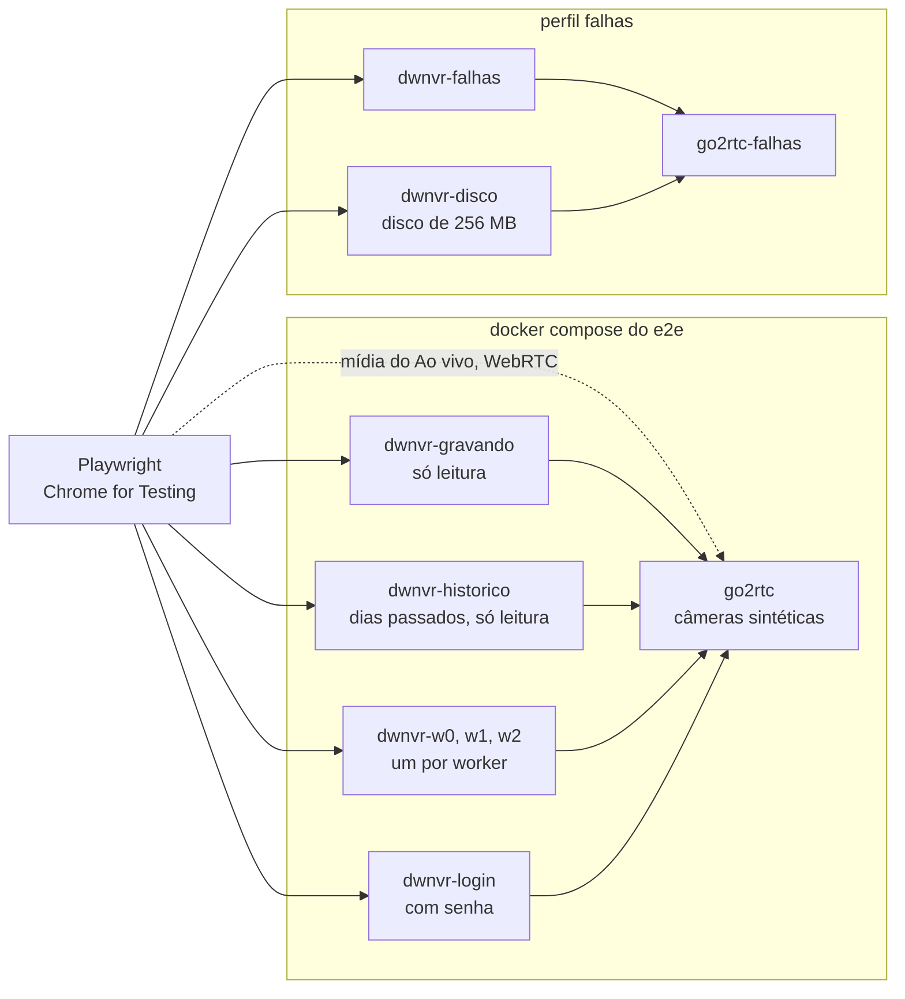

# Plano: testes ponta a ponta com Playwright <!-- omit in toc -->

**Status: plano.** Nada daqui está implementado ainda. Escrito em 02/10/2026,
depois de um spike que provou, rodando, as premissas de maior risco (ver
[O que já foi verificado](#o-que-já-foi-verificado)).

Os testes de unidade do Go (`make test`) cobrem o que quebra em silêncio dentro
do servidor: a leitura de caixas fMP4, o corte em keyframe, a retenção, os
endpoints. Fica de fora o que só aparece com tudo junto: um navegador de
verdade, na tela de um celular, tocando o vídeo que o dwnvr gravou do go2rtc, no
instante que a timeline promete. É isso que este plano cobre, em etapas, da
mais vital para a menos.

Cada etapa é um pull request que se fecha sozinho: entra verde, no notebook e
na CI, e a seguinte parte dela. As caixas de cada etapa são o acompanhamento:
marque-as no mesmo PR que implementa o cenário, e anote aqui o que mudou do
plano. O plano é vivo.

- [Em uma página](#em-uma-página)
- [O que já foi verificado](#o-que-já-foi-verificado)
- [Conceitos do Playwright usados aqui](#conceitos-do-playwright-usados-aqui)
- [Princípios](#princípios)
- [O ambiente de teste](#o-ambiente-de-teste)
  - [Topologia](#topologia)
  - [As câmeras sintéticas](#as-câmeras-sintéticas)
  - [O relógio queimado no vídeo](#o-relógio-queimado-no-vídeo)
  - [As instâncias do dwnvr](#as-instâncias-do-dwnvr)
  - [De onde vêm as gravações](#de-onde-vêm-as-gravações)
  - [Injeção de falha](#injeção-de-falha)
- [Estrutura de arquivos](#estrutura-de-arquivos)
- [Configuração do Playwright](#configuração-do-playwright)
- [Como um teste fica](#como-um-teste-fica)
- [Como rodar](#como-rodar)
- [As etapas](#as-etapas)
  - [Etapa 1 - Fundação](#etapa-1---fundação)
  - [Etapa 2 - Gravação e reprodução](#etapa-2---gravação-e-reprodução)
  - [Etapa 3 - Perceber que parou de gravar](#etapa-3---perceber-que-parou-de-gravar)
  - [Etapa 4 - Cadastro de câmeras](#etapa-4---cadastro-de-câmeras)
  - [Etapa 5 - Ao vivo](#etapa-5---ao-vivo)
  - [Etapa 6 - Login e sessão](#etapa-6---login-e-sessão)
  - [Etapa 7 - Retenção e disco](#etapa-7---retenção-e-disco)
  - [Etapa 8 - Resoluções, toque e visual](#etapa-8---resoluções-toque-e-visual)
  - [Etapa 9 - Detecção de movimento e de objetos](#etapa-9---detecção-de-movimento-e-de-objetos)
  - [Etapa 10 - Leveza e desempenho](#etapa-10---leveza-e-desempenho)
  - [Etapa 11 - CI completa](#etapa-11---ci-completa)
  - [Etapa 12 - Outros navegadores](#etapa-12---outros-navegadores)
- [Integração com o repositório](#integração-com-o-repositório)
- [Riscos e armadilhas](#riscos-e-armadilhas)
- [Decisões em aberto](#decisões-em-aberto)
- [Para retomar no notebook](#para-retomar-no-notebook)

## Em uma página

| Decisão | Escolha | Por quê |
| --- | --- | --- |
| Ferramenta | Playwright Test 1.63 (a última, de 04/09/2026), em TypeScript, num pacote próprio em `e2e/` | O executor, as fixtures, o vídeo, o trace e o relatório vêm no mesmo pacote. O TypeScript dá autocomplete da API inteira no editor, o que conta muito para quem está começando |
| Navegador | O Chromium que o Playwright baixa, que desde a 1.57 é o Chrome for Testing, em Linux x86_64 | Toca H.264 por MSE, WebCodecs e WebRTC, que é o que as telas usam. O Chromium de código aberto, usado até a 1.56, não toca nenhum dos três (verificado) |
| Ambiente | `docker compose` com o go2rtc da mesma versão da produção e o dwnvr construído do código do PR | É a topologia da instalação de verdade, com o mesmo teto de memória. Nada da API do dwnvr é simulado |
| Câmeras | Geradas na hora pelo ffmpeg de dentro do go2rtc, com o relógio de parede queimado na imagem. Um clipe real, de licença CC-BY, só para o detector de objetos | Conteúdo infinito e determinístico, sem vídeo grande no repositório. O relógio queimado vira oráculo: dá para conferir que o quadro na tela é o instante que a tela diz |
| Isolamento | Uma instância do dwnvr por worker do Playwright para o que muda estado, e instâncias só de leitura para o resto, todas lendo o mesmo go2rtc | Testes em paralelo sem um pisar no `cameras.json` do outro. O go2rtc entrega o mesmo stream a todas sem codificar de novo |
| Resoluções | Projetos do Playwright: `desktop` e `celular` desde a primeira etapa; a matriz completa na [Etapa 8](#etapa-8---resoluções-toque-e-visual) | Todo teste roda nas duas pontas desde o começo; a matriz inteira fica para o que é de layout |
| Vídeo | Sempre ligado, com o nome do teste, o passo atual e o destaque de cada ação desenhados no próprio vídeo (recurso recente do Playwright) | Foi o pedido, e é o que deixa entender uma falha da CI sem rodar de novo |
| Local | `make e2e-up`, `make e2e`, `make e2e-ui`, `make e2e-down` | Os mesmos passos no notebook e na CI |
| CI | Workflow novo, `e2e.yml`, separado do `ci.yml` como o `lint.yml`; e uma rodada agendada, de madrugada, com a suíte completa | Começa avisando, sem segurar a publicação das imagens; passa a exigir quando estiver estável (ver [Decisões em aberto](#decisões-em-aberto)) |

## O que já foi verificado

Em 02/10/2026, num container Linux x86_64 (o da sessão do Claude Code na web),
com o go2rtc 1.9.14, o dwnvr deste commit e o Playwright dirigindo o navegador.
O código do spike não entrou no repositório; o que importa dele está
reproduzido nas seções abaixo, já validado.

| O quê | Resultado |
| --- | --- |
| Codecs no Chromium de código aberto (o do Playwright 1.56, Chrome 141) | `MediaSource.isTypeSupported` falso para H.264 e H.265, e WebCodecs e WebRTC sem H.264. Nem Gravações nem Ao vivo funcionariam |
| Codecs no Chrome for Testing 141 (o tipo de build que o Playwright usa desde a 1.57) | H.264 sim em MSE (também com FLAC e com AAC), em WebCodecs e em WebRTC. H.265 não, em nenhum: sem GPU, o Chrome no Linux não decodifica HEVC |
| Ambiente sem Docker | go2rtc 1.9.14 (o binário) com o ffmpeg do sistema, mais o dwnvr de `go build`: subiram e gravaram |
| Ambiente com `docker compose` | go2rtc 1.9.14 (a imagem oficial) e o dwnvr numa imagem `FROM scratch` como a de produção: o mesmo resultado |
| Do cadastro pela tela ao primeiro trecho no índice | ~12 s, com segmento de 10 s e keyframe a cada 2 s |
| Relógio da tela contra o relógio queimado no quadro, na reprodução | Diferença de 0 s, nos dois ambientes |
| Ao vivo | Negociou WebRTC (o player escreve `RTC` no canto); atraso medido pelo relógio queimado: ~1 s |
| Vídeo da sessão | WebM VP8 em 1280x720, com o player tocando, a tira de miniaturas e o Ao vivo visíveis; 1,7 MB para 19 s |
| Celular (Pixel 7 emulado) | Navegação inferior visível e a superior oculta, sem rolagem horizontal. Tocar na timeline pula para o instante tocado. A pinça de dois dedos, por eventos de toque pelo CDP, dá zoom, e o `zoom=` aparece na URL |
| Endereço de LAN (`http://servidor-lan:8080`, resolvido para a própria máquina pelo Chrome) | Contexto não seguro e sem WebCodecs, como na rede de casa; o H.264 por MSE continua tocando |
| go2rtc que emudece (`docker compose pause go2rtc`) | Aos 15 s o dwnvr derruba a conexão ("go2rtc não enviou nada por 15s") e conta 1 reconexão; depois do `unpause`, volta sozinho em menos de 5 s |
| Imagens | O Docker Hub respondeu `429 Too Many Requests` naquele ambiente; o mesmo go2rtc 1.9.14 veio do `ghcr.io/alexxit/go2rtc` sem problema. A imagem do go2rtc traz ffmpeg 8.0.1 com `drawtext`, `geq` e `realtime`, as fontes Droid e o bash |

Ainda não verificado, e por isso é o primeiro passo da
[Etapa 1](#etapa-1---fundação): o Playwright 1.63 inteiro (o spike usou a
biblioteca da 1.56 apontada para o binário do Chrome for Testing) e as
anotações desenhadas no vídeo.

## Conceitos do Playwright usados aqui

| Termo | O que é, neste projeto |
| --- | --- |
| **teste** e **spec** | Um `test('...', async ({ page }) => { ... })` num arquivo `*.spec.ts`. Cada teste ganha um navegador limpo: contexto novo, sem cookie e sem `localStorage` |
| **locator** | Como o teste acha um elemento: de preferência como uma pessoa acharia, pelo papel e pelo nome acessível (`getByRole('button', { name: 'salvar' })`) ou pelo rótulo (`getByLabel('Cota em disco (MB)')`). A interface já tem `aria-label` em quase tudo |
| **asserção web-first** | `await expect(locator).toBeVisible()` espera sozinha até a condição valer ou o prazo acabar. É o que tira o `sleep` dos testes |
| **fixture** | O que o teste recebe pronto nos parâmetros: `page`, `request`, e as nossas, como a instância do dwnvr do worker. Ela prepara o estado antes e desmonta depois |
| **worker** | Um processo que roda testes. Com 3 workers, 3 arquivos rodam ao mesmo tempo, e cada worker terá o seu dwnvr |
| **projeto** | Uma configuração inteira sob a qual os testes rodam: navegador, resolução, opções. `desktop` e `celular` são projetos, e o mesmo teste roda em cada um |
| **tag** | Um rótulo no teste, como `@lento` ou `@visual`, que escolhe o que roda onde (`--grep @visual`) |
| **trace** | A gravação completa de um teste: cada ação, o DOM antes e depois, a rede e o console. Abre no Trace Viewer, e é a melhor ferramenta para entender uma falha |
| **vídeo** | A tela do navegador gravada durante o teste, em WebM |
| **relatório HTML** | A página com o resultado de cada teste, onde o vídeo e o trace de cada um ficam a um clique |
| **snapshot** | Uma imagem, ou uma árvore de acessibilidade, já aprovada, contra a qual a tela é comparada |

## Princípios

1. **Real por padrão.** go2rtc de verdade, ffmpeg de verdade, o dwnvr do código
   do PR na imagem de verdade, Chrome de verdade. Dublê só onde o real não
   consegue produzir o cenário, e com o nome dito no próprio teste: o aviso de
   versão nova (a API do GitHub), um navegador sem `MediaSource`.
2. **O teste olha o que a pessoa vê.** Acha elementos por papel, rótulo e texto
   em português, como quem usa. Seletor de CSS só onde não há nome a usar (o
   `<canvas>` da timeline, os `<video>`, os avisos sobre o vídeo), e de
   preferência guardado num apoio, e não espalhado pelos testes.
3. **A URL é o oráculo do estado.** A interface escreve a cena no hash
   (`#rec?cam=…&day=…&t=…&zoom=…`, ver [`web/README.md`](../web/README.md)).
   Conferir a URL depois de um gesto é mais robusto que conferir pixel.
4. **O relógio queimado é o oráculo do vídeo.** Tocar não basta: o quadro na
   tela tem que ser o instante que a tela diz.
5. **Nenhum `sleep`.** Espera é asserção web-first ou `expect.poll`. A exceção é
   a injeção de falha, onde o tempo é o próprio cenário (os 15 s do
   `stallSeconds`), e ela leva o porquê num comentário.
6. **Isolado e em qualquer ordem.** O teste que muda estado começa zerando a
   instância do seu worker, e nunca depende de outro ter rodado antes.
7. **Nada no código de produção só para o teste.** Nem rota de teste, nem
   `data-testid` por conveniência. Se um elemento não tem nome acessível, o
   certo é dar um, num commit próprio: o teste e o leitor de tela ganham juntos.
8. **Flaky é defeito.** Um teste que às vezes falha não ganha mais `retries`,
   nem `skip`, nem `fixme`: ganha uma correção, ou um arquivo em
   [`docs/TODO/`](TODO/) com o que se sabe.
9. **Comentário diz o porquê**, como no resto do repositório, e em português.

## O ambiente de teste

### Topologia



O Playwright roda na máquina, fora do compose, e fala com cada dwnvr por HTTP,
numa porta publicada em `localhost`. Cada dwnvr lê o fMP4 do seu go2rtc. A
mídia do Ao vivo vai direto do navegador ao go2rtc pela porta do WebRTC, como na
instalação de verdade.

O par de falhas é separado porque pausar, parar ou reiniciar o go2rtc
compartilhado derrubaria o Ao vivo e a gravação dos testes que rodam em
paralelo. O perfil `detect` (a [Etapa 9](#etapa-9---detecção-de-movimento-e-de-objetos))
acrescenta o `dwnvr-detect` e uma instância apontada para ele.

Os serviços do e2e herdam os do [`docker-compose.yml`](../docker-compose.yml)
da raiz com `extends`, e trocam só imagem, porta, volume e o `restart` (as
listas com `!override`). Assim a versão do go2rtc, o teto de 128 MB do dwnvr e
o usuário do container são os da produção, sem uma cópia que envelheça. Se o
`extends` se mostrar desajeitado na Etapa 1, a saída é a cópia explícita, com
uma linha nova nas Repercussões do [`AGENTS.md`](../AGENTS.md).

### As câmeras sintéticas

Moram no `go2rtc.yaml` do e2e. O go2rtc só liga o ffmpeg de uma câmera enquanto
alguém a consome, e liga uma vez só para todos os consumidores: três instâncias
do dwnvr gravando a mesma câmera custam um codificador.

| Stream | O que entrega | Para quê |
| --- | --- | --- |
| `cam_relogio` | `testsrc2` em 640x360, 15 fps, keyframe a cada 2 s, com a hora de parede em texto e numa faixa binária | O oráculo: reprodução, seek, velocidade, miniatura, exportação, captura de imagem e atraso do Ao vivo |
| `cam_relogio_hd` | O mesmo em 1920x1080 | Vídeo encolhido no celular, captura no tamanho nativo, cota e disco que enchem rápido. Só é cadastrada no teste que precisa dela: codificar 1080p sem parar custa CPU de verdade no runner |
| `cam_audio` | A carta `avsynctest` com som em `pcm_alaw` de 16 kHz, como a `cam_teste5` do [`go2rtc.example.yaml`](../go2rtc.example.yaml) | Sonda de áudio, modo FLAC, troca de geração do init |
| `cam_audio_aac` | A `cam_audio` com uma segunda fonte `ffmpeg:…#audio=aac`, como no exemplo 3 do mesmo arquivo | O modo AAC |
| `cam_movimento` | Barras paradas, com rajadas de ruído de 5 s a cada minuto | Marcas de movimento do mecanismo estatístico |
| `cam_h265` | `testsrc2` em H.265 | O gravador em H.265, e a mensagem de quem não decodifica HEVC, que é o caso do Chrome no Linux sem GPU |
| `cam_instavel` | Um `exec:` que encerra o ffmpeg a cada 20 s | Reconexões em série e o aviso delas |
| `cam_morta` | Um RTSP para uma porta fechada | Câmera que nunca conecta |
| `cam_pessoas` | Um clipe real de câmera de segurança, CC-BY, em loop | O detector de objetos de verdade (Etapa 9) |

Pré-gravar vídeo para tudo isso seria pior: arquivo grande no repositório, que
acaba, e sem relação com o relógio de parede. O único clipe pré-gravado é o do
detector, porque o modelo precisa de gente e carro de verdade, e desenho
sintético não serve.

### O relógio queimado no vídeo

A `cam_relogio` é um script que o go2rtc roda com `exec:`. O ffmpeg desenha em
cada quadro a hora de parede em dois formatos: em texto, para quem assiste ao
vídeo do teste, e numa faixa de 20 blocos no topo, para o teste ler. O bloco
*i* é branco quando o bit *i* do instante em segundos (epoch) é 1, e a faixa
inteira guarda o epoch módulo 2^20, que só se repete a cada ~12 dias.

O script abaixo é o que rodou no spike, dentro da imagem oficial do go2rtc:

```sh
#!/usr/bin/env bash
# e2e/ambiente/cameras/relogio.sh: o go2rtc o chama com
#   cam_relogio: exec:/cameras/relogio.sh {output}
set -euo pipefail
saida="$1"
e0=$(date +%s)
fonte=/usr/share/fonts/droid/DroidSansMono.ttf
hora='%{localtime\:%H\\\:%M\\\:%S}'
grafo="color=c=black:s=640x24:r=15,format=yuv420p,geq=lum='255*mod(floor(($e0+T)/pow(2,floor(X/32))),2)':cb=128:cr=128[faixa];testsrc2=size=640x360:rate=15,format=yuv420p[fundo];[fundo][faixa]overlay=0:0,drawtext=fontfile=$fonte:text='$hora':x=10:y=40:fontsize=40:fontcolor=white:box=1:boxcolor=black@0.7,realtime[v]"
exec ffmpeg -hide_banner -loglevel error -filter_complex "$grafo" -map '[v]' \
  -c:v libx264 -g 30 -profile:v high -preset superfast -tune zerolatency -pix_fmt yuv420p \
  -rtsp_transport tcp -f rtsp "$saida"
```

A leitura é feita no próprio navegador: o `<video>` das Gravações é alimentado
por MSE com bytes da mesma origem, então o canvas não fica marcado e os pixels
podem ser lidos (é o mesmo motivo pelo qual a captura de imagem funciona; ver
`web/src/lib/captura.js`). No Ao vivo, o vídeo do WebRTC também se lê assim.

```ts
// e2e/apoio/relogio.ts (esboço): o instante, em segundos módulo 2^20,
// queimado no quadro que o <video> mostra agora.
export async function relogioDoVideo(video: Locator): Promise<number> {
  return video.evaluate((v: HTMLVideoElement) => {
    const c = document.createElement('canvas');
    c.width = v.videoWidth;
    c.height = v.videoHeight;
    const g = c.getContext('2d')!;
    g.drawImage(v, 0, 0);
    const escala = v.videoWidth / 640; // a faixa foi desenhada em 640 px
    let valor = 0;
    for (let i = 0; i < 20; i++) {
      const [r, gr, b] = g.getImageData((32 * i + 16) * escala, 12 * escala, 1, 1).data;
      if ((r + gr + b) / 3 > 127) valor |= 1 << i;
    }
    return valor;
  });
}
```

O que se compara com isso é o instante da tela, convertido no próprio
navegador, que está no fuso do teste: o dia vem do `day=` da URL e a hora do
relógio das Gravações. A volta do módulo e a tolerância (1 s na reprodução)
ficam no apoio, e não em cada teste.

### As instâncias do dwnvr

| Instância | Porta | Estado | Para quê |
| --- | --- | --- | --- |
| `dwnvr-gravando` | 18080 | `cam_relogio` e `cam_audio` (com FLAC) cadastradas desde a subida, gravando em segmentos de 10 s | Todo teste que só lê uma gravação recente ou o Ao vivo |
| `dwnvr-w0`, `w1`, `w2` | 18081 a 18083 | Do worker de mesmo `parallelIndex`, zerado pela fixture | Tudo o que cadastra, edita, remove ou apaga |
| `dwnvr-historico` | 18085 | Dias passados pré-gerados, câmeras desabilitadas, `detector.url` apontado para um endereço que não existe | Calendário, buracos, troca de geração, trecho corrompido, a virada da meia-noite, detecções antigas, snapshots |
| `dwnvr-login` | 18090 | Com `server.username` e `server.password` | Login e sessão |
| `dwnvr-falhas` | 18095 | Com o seu `go2rtc-falhas`, no perfil `falhas` | Pausar, parar e reiniciar o go2rtc; matar o dwnvr |
| `dwnvr-disco` | 18096 | Disco de 256 MB e `minFreeMB` de 240, no perfil `falhas` | Disco abaixo do mínimo e a retenção apagando de verdade |
| `dwnvr-deteccao` | 18097 | Com o `dwnvr-detect`, no perfil `detect` | O detector de objetos |

O `/storage` das instâncias que só gravam do zero é um tmpfs de tamanho fixo.
Além de sumir no `down`, ele deixa o "disco cheio" reproduzível: a retenção
mede o espaço livre do sistema de arquivos onde grava, e num tmpfs de 256 MB o
mínimo livre estoura em minutos, sem encher o disco do runner. Duas não podem
ser tmpfs, porque o conteúdo de um tmpfs some quando o container para: a
`dwnvr-historico`, que sobe com o que a semente escreveu, e a `dwnvr-falhas`,
cuja queda de energia precisa que o disco sobreviva ao reinício. Essas duas, e o
`/etc/dwnvr` de todas, são pastas em `e2e/.estado/`, montadas a cada
`make e2e-up` a partir dos modelos versionados.

Os modelos não podem se chamar `dwnvr.yaml`, `cameras.json` nem `go2rtc.yaml`:
o [`.gitignore`](../.gitignore) ignora esses nomes em qualquer pasta, de
propósito, porque o arquivo de verdade leva senha. Os do e2e se chamam, por
exemplo, `gravando.dwnvr.yaml` e `go2rtc.e2e.yaml`, e o compose os monta com o
nome que o container espera. A senha da `dwnvr-login` é `senha`, que o filtro
do [`.betterleaks.toml`](../.betterleaks.toml) já conhece, e o usuário não pode
ser `admin`, que ele só tolera em `_test.go`.

### De onde vêm as gravações

1. **Ao vivo:** os streams do go2rtc, sempre no ar.
2. **Gravação recente:** a `dwnvr-gravando` grava desde que o ambiente subiu. Um
   projeto de preparação (`ambiente.setup.ts`, do qual os outros dependem)
   espera dois trechos da `cam_relogio` no índice antes de qualquer teste, e
   falha com uma mensagem clara se não vierem em 60 s.
3. **Dias passados:** gerados antes de a `dwnvr-historico` subir, pelo
   `e2e/semente`, um programa em Go que usa os pacotes `internal/store` e
   `internal/fmp4` do próprio dwnvr.

A semente funciona em dois passos. Primeiro, o ffmpeg da imagem do go2rtc
(`docker compose run`) gera, para cada sessão planejada, um MP4 fragmentado no
formato do go2rtc, um fragmento por quadro (`-movflags
frag_every_frame+empty_moov+default_base_moof`), com o relógio queimado no
instante planejado e não no de agora. Depois, o Go corta em keyframe, reescreve
o `tfdt` com `fmp4.RebaseMoof`, grava cada trecho no caminho de
`store.Camera.SegmentPath` e a linha do índice com os campos que o
`fmp4.ProbeSegment` devolve, exatamente como a reconciliação do boot faria. A
primeira coisa a conferir, ao escrevê-la, é que o `ProbeSegment` aceita o que o
ffmpeg gerou; se não aceitar, a alternativa é gravar 30 s da `cam_relogio`
direto do `/api/stream.mp4` do go2rtc e trocar só as datas.

Reaproveitar os pacotes do dwnvr é o que mantém a semente honesta: se o formato
em disco mudar ([`arquitetura.md`](arquitetura.md#armazenamento)), ela para de
compilar, em vez de gerar em silêncio um disco que o dwnvr de hoje já não
escreve. Um disco pronto versionado envelheceria assim.

O cenário padrão usa datas fixas, para o calendário e os snapshots não mudarem
com o dia em que o teste roda:

| Câmera | Dias | O que tem |
| --- | --- | --- |
| `cam_historico` | 10, 12, 13 e 15/01/2026 | 08:00 a 12:00, com um buraco de 15 min às 09:30. O dia 13 tem só 23:58 a 00:02, atravessando a meia-noite para o 14 |
| `cam_historico_audio` | 15/01/2026 | Sem áudio até as 10:00 e com FLAC depois: duas gerações de init no mesmo dia |
| `cam_historico_corrompida` | 15/01/2026 | Um trecho com bytes do `mdat` trocados às 11:00:30, como o pacote perdido no UDP que o player aprendeu a pular |
| `cam_historico_deteccoes` | 14 e 15/01/2026 | Marcas de movimento a cada 36 s e objetos (pessoa, veículo, animal, e pessoa com moto no mesmo instante), com caixa e o JPEG do quadro |
| `cam_removida` | 10/01/2026 | Pasta com índice e sem cadastro: aparece em "Gravações sem câmera" |
| `cam_sem_indice` | - | Pasta sem índice: o chip "sem índice" |

Com as câmeras desabilitadas, a `dwnvr-historico` não grava nada novo e o
último dia do calendário é sempre o 15/01. Os testes que dependem do "hoje"
congelam só o `Date` do navegador (`page.clock.setFixedTime`, que não mexe nos
timers). O relógio falso inteiro (`page.clock.install`), que adianta timers,
nunca entra numa tela que toca vídeo.

### Injeção de falha

| Falha de verdade | Como o teste provoca | O que a tela tem que dizer |
| --- | --- | --- |
| O go2rtc emudece: produtor RTSP morto, conexão aberta (ver [`resiliencia.md`](resiliencia.md#quando-o-go2rtc-emudece)) | `docker compose pause go2rtc-falhas` | Aos 15 s, "*câmera* desconectada desde …: go2rtc não enviou nada por 15s"; com 1 min sem trecho, "NÃO ESTÁ GRAVANDO"; depois do `unpause`, os avisos somem sozinhos |
| O go2rtc fora do ar | `docker compose stop go2rtc-falhas` | "go2rtc inacessível desde …" no Diagnóstico e "Não foi possível falar com o go2rtc" em Câmeras; somem sem recarregar quando ele volta |
| Queda de energia (ver [`resiliencia.md`](resiliencia.md#recuperação-de-queda)) | `docker compose kill -s KILL dwnvr-falhas`, um arquivo de zero byte no dia corrente, e `start` | O trecho órfão volta para a timeline, o de zero byte some, e só o tempo fora do ar vira buraco |
| Câmera que cai e volta | A `cam_instavel` | Passadas 10 reconexões, o aviso com a taxa por hora e "a última às …" |
| Disco abaixo do mínimo | A `dwnvr-disco` grava a `cam_relogio_hd` até passar dos 16 MB que separam o tamanho do tmpfs do mínimo livre | "Disco abaixo do mínimo livre … A retenção está apagando gravações antigas de todas as câmeras", e o começo da timeline anda para a frente a cada passada da retenção |
| O detector de objetos fora do ar | `docker compose stop dwnvr-detect` | "Detector de objetos inacessível desde …", com as câmeras gravando |
| O `go2rtc.yaml` editado com tudo no ar | O teste acrescenta uma câmera no arquivo montado do `go2rtc-falhas` | O aviso com a câmera "nova", o "reiniciar go2rtc" e a câmera aparecendo para cadastrar |

Os comandos saem de um apoio só (`e2e/apoio/docker.ts`), que chama o
`docker compose` com o arquivo e o perfil certos. Os testes de falha rodam
numa chamada à parte, com um worker só (`make e2e-falhas`): é o jeito de
garantir que dois deles nunca mexam no mesmo go2rtc ao mesmo tempo.

## Estrutura de arquivos

```text
e2e/
├── package.json             @playwright/test fixado, typescript, eslint
├── package-lock.json
├── playwright.config.ts     projetos, vídeo, trace, relatórios
├── tsconfig.json
├── eslint.config.js
├── ambiente/
│   ├── compose.yml          go2rtc e as instâncias do dwnvr; perfis falhas e detect
│   ├── go2rtc.e2e.yaml      as câmeras sintéticas
│   ├── cameras/             relogio.sh, instavel.sh, movimento.sh
│   └── dwnvr/               o dwnvr.yaml de cada instância (gravando.dwnvr.yaml, ...)
├── semente/                 o gerador dos dias passados (Go, package main)
├── apoio/
│   ├── fixtures.ts          test.extend: instância do worker, instâncias de leitura
│   ├── api.ts               preparar estado pela API pública: cadastrar, zerar, esperar trecho
│   ├── relogio.ts           ler o relógio queimado de um <video> ou de uma imagem
│   ├── timeline.ts          tocar num instante do canvas, arrastar, pinçar pelo CDP
│   └── docker.ts            pausar, parar e reiniciar serviço do compose
└── testes/
    ├── ambiente.setup.ts
    ├── fumaca.spec.ts
    ├── gravacoes/
    ├── diagnostico/
    ├── cameras/
    ├── aovivo/
    ├── login/
    ├── retencao/
    ├── responsivo/
    ├── deteccao/
    └── leveza/
```

Um pacote próprio, e não dentro do `web/`: o `web/` é a aplicação, e o
Playwright, com o navegador que ele baixa, só serve aos testes. Separado, o
`npm ci` do `web/`, que o `ci.yml` e o `lint.yml` rodam, continua leve, e o
Dependabot propõe a atualização do Playwright num PR só dela, que às vezes pede
snapshot novo. O [`.dockerignore`](../.dockerignore) é uma lista do que entra,
então o `e2e/` fica fora do build da imagem sem nenhuma linha nova.

A `semente` em Go fica dentro do módulo de propósito: só assim ela importa o
`internal/`. Em troca, `go build ./...`, `go test ./...` e o golangci-lint
passam a vê-la, o que é bom: ela quebra junto com o formato.

## Configuração do Playwright

O esboço do essencial. Os projetos da matriz de resoluções e os de `lan`,
`falhas` e `visual` entram nas etapas deles.

```ts
// e2e/playwright.config.ts (esboço)
import { defineConfig, devices } from '@playwright/test';

const CI = !!process.env.CI;

// O vídeo do tamanho da viewport: sem `size`, o Playwright o encolhe para
// caber em 800x800, e o texto da tela fica ilegível no vídeo de um desktop.
const video = (width: number, height: number) => ({
  mode: 'on' as const,
  size: { width, height },
  show: {
    actions: { position: 'top-right' as const },
    test: { level: 'step' as const, position: 'top-left' as const },
  },
});

export default defineConfig({
  testDir: './testes',
  // Vídeo leva tempo: um trecho só fecha a cada 10 s.
  timeout: 90_000,
  expect: { timeout: 15_000 },
  // Um worker por instância dwnvr-w0..w2: o parallelIndex escolhe a dele.
  workers: 3,
  retries: CI ? 1 : 0,
  forbidOnly: CI,
  reporter: CI ? [['github'], ['html', { open: 'never' }]] : [['list'], ['html', { open: 'never' }]],
  use: {
    locale: 'pt-BR',
    // O mesmo fuso dos containers: a timeline vira o dia na hora local.
    timezoneId: 'America/Fortaleza',
    trace: 'retain-on-failure',
    screenshot: 'only-on-failure',
  },
  projects: [
    { name: 'ambiente', testMatch: /ambiente\.setup\.ts/ },
    {
      name: 'desktop',
      dependencies: ['ambiente'],
      grepInvert: /@visual|@responsivo|@so-celular/,
      use: { ...devices['Desktop Chrome'], viewport: { width: 1366, height: 768 }, video: video(1366, 768) },
    },
    {
      name: 'celular',
      dependencies: ['ambiente'],
      grepInvert: /@visual|@responsivo|@so-desktop/,
      use: { ...devices['Pixel 7'], video: video(412, 839) },
    },
  ],
});
```

As tags dizem onde cada teste roda:

| Tag | Quer dizer |
| --- | --- |
| `@vital` | O mínimo que segura um PR, se um dia a suíte inteira ficar lenta demais para ele |
| `@lento` | Espera minutos de propósito (uma falha que só aparece em 1 min, uma cota que enche). Fora do PR, dentro da rodada agendada |
| `@so-desktop`, `@so-celular` | Gesto que só existe num deles: roda do mouse, pinça |
| `@responsivo` | Roda em toda a matriz de resoluções (Etapa 8) |
| `@visual` | Snapshot de pixels, só dentro da imagem do Playwright (Etapa 8) |
| `@lan` | Roda no projeto de contexto não seguro (Etapa 2) |

## Como um teste fica

A fixture escolhe a instância do worker e entrega o estado pronto. O teste
fica com o que importa: o que a pessoa faz e o que ela vê.

```ts
// e2e/apoio/fixtures.ts (esboço)
import { test as base, expect, type APIRequestContext } from '@playwright/test';
import { zerar } from './api';

type Instancia = { baseURL: string; api: APIRequestContext };

export const test = base.extend<{ limpa: Instancia }, { doWorker: Instancia; gravando: Instancia }>({
  // Um dwnvr por worker. O parallelIndex vai de 0 a workers-1 e continua o
  // mesmo quando um worker morre e outro assume o lugar.
  doWorker: [
    async ({ playwright }, use, workerInfo) => {
      const baseURL = `http://localhost:${18081 + workerInfo.parallelIndex}`;
      const api = await playwright.request.newContext({ baseURL });
      await use({ baseURL, api });
      await api.dispose();
    },
    { scope: 'worker' },
  ],

  // O que muda estado começa do zero: sem câmera, sem órfã, sem gravação.
  // Zerar é pela API pública, como uma pessoa faria pela tela.
  limpa: async ({ doWorker }, use) => {
    await zerar(doWorker.api);
    await use(doWorker);
  },

  // Só leitura: a instância que grava a cam_relogio desde que o ambiente subiu.
  gravando: [
    async ({ playwright }, use) => {
      const baseURL = 'http://localhost:18080';
      const api = await playwright.request.newContext({ baseURL });
      await use({ baseURL, api });
      await api.dispose();
    },
    { scope: 'worker' },
  ],
});

export { expect };
```

```ts
// e2e/testes/gravacoes/relogio.spec.ts (esboço)
import { test, expect } from '../../apoio/fixtures';
import { relogioDoVideo, instanteDaTela, mesmoSegundo } from '../../apoio/relogio';

test('o quadro na tela é o instante que a tela diz', { tag: '@vital' }, async ({ page, gravando }) => {
  await page.goto(`${gravando.baseURL}/#rec?cam=cam_relogio`);
  const video = page.locator('.stage video');

  await test.step('toca o trecho mais recente, sem aviso de erro', async () => {
    await expect.poll(() => video.evaluate((v: HTMLVideoElement) => v.currentTime)).toBeGreaterThan(0.5);
    await expect(page.locator('.avisos .bad')).toHaveCount(0);
  });

  await test.step('o relógio queimado no vídeo bate com o relógio da tela', async () => {
    await page.getByRole('button', { name: 'tocar ou pausar' }).click();
    const tela = await instanteDaTela(page);
    expect(mesmoSegundo(tela, await relogioDoVideo(video), 1)).toBe(true);
  });
});
```

E o gesto que nenhum clique simula, a pinça de dois dedos, que o spike validou:

```ts
// e2e/apoio/timeline.ts (esboço): os toques saem do próprio Chrome, pelo
// CDP, com pointerId de verdade. Evento sintético no DOM não serve: o
// setPointerCapture da timeline recusa um ponteiro que não existe.
export async function pincar(page: Page, alvo: Locator, de = 20, ate = 160) {
  const caixa = (await alvo.boundingBox())!;
  const x = caixa.x + caixa.width / 2;
  const y = caixa.y + caixa.height / 2;
  const dedos = (d: number) => [{ x: x - d, y, id: 1 }, { x: x + d, y, id: 2 }];
  const cdp = await page.context().newCDPSession(page);
  await cdp.send('Input.dispatchTouchEvent', { type: 'touchStart', touchPoints: dedos(de) });
  for (let d = de; d <= ate; d += 10) {
    await cdp.send('Input.dispatchTouchEvent', { type: 'touchMove', touchPoints: dedos(d) });
  }
  await cdp.send('Input.dispatchTouchEvent', { type: 'touchEnd', touchPoints: [] });
}
```

## Como rodar

No notebook, Linux x86_64 com Docker:

```sh
# Uma vez por máquina: as dependências e o navegador do Playwright.
cd e2e && npm ci && npx playwright install --with-deps chromium && cd ..

make e2e-up          # sobe o ambiente, com o dwnvr construído do seu clone
make e2e             # roda tudo, com vídeo
make e2e-ui          # o modo UI: escolher teste, ver passo a passo, rodar de novo
make e2e-falhas      # os testes de injeção de falha, num worker só
make e2e-relatorio   # abre o relatório HTML, com o vídeo e o trace de cada teste
make e2e-down        # derruba e apaga o estado
```

O `make e2e-up` fica no ar entre uma rodada e outra: subir é a parte lenta.
Dentro de `e2e/`, os comandos do Playwright que mais ajudam no começo:

```sh
npx playwright test testes/gravacoes --project=celular   # uma pasta, um projeto
npx playwright test -g "relógio"                          # pelo título
npx playwright test --headed                              # vendo o navegador
npx playwright test --debug                               # passo a passo, no Inspector
npx playwright codegen http://localhost:18081             # clica e ele escreve o teste
npx playwright show-trace test-results/<pasta>/trace.zip  # o trace de uma falha
```

O `codegen` é o melhor professor para quem nunca escreveu um teste: cada clique
vira uma linha, com o locator que o Playwright escolheria.

No Mac, o Playwright roda nativo, que também usa o Chrome for Testing, contra o
compose. Num Mac com chip M, nunca dentro de um container `linux/arm64`: ali o
Playwright usa o Chromium sem H.264 (ver [Riscos e armadilhas](#riscos-e-armadilhas)).

## As etapas

| Etapa | O quê | Por que nesta ordem | Tamanho |
| --- | --- | --- | --- |
| 1 | Fundação | Sem ela nada roda, e ela já traz o primeiro teste vital | M |
| 2 | Gravação e reprodução | É para isso que um NVR existe | G |
| 3 | Perceber que parou de gravar | É "a segunda função mais importante depois de gravar", como diz o `recorder.go` | M |
| 4 | Cadastro de câmeras | É por onde tudo começa, e é o que mais mexe em estado | M |
| 5 | Ao vivo | Uso de todo dia | M |
| 6 | Login e sessão | Segurança | P |
| 7 | Retenção e disco | Protege o disco, e erra em silêncio | P |
| 8 | Resoluções, toque e visual | A matriz completa de resoluções e os snapshots | M |
| 9 | Detecção | Opcional no produto, e a mais cara de testar | G |
| 10 | Leveza e desempenho | A promessa do projeto, vigiada | P |
| 11 | CI completa | Endurecer o que já existe | P |
| 12 | Outros navegadores | Opcional, e não bloqueia nada | P |

As resoluções não esperam a Etapa 8: `desktop` e `celular` valem desde a
Etapa 1, e cada etapa traz os cenários de toque dela. A Etapa 8 é a matriz
inteira, e pode vir antes se as telas no celular forem a dor do momento.

### Etapa 1 - Fundação

**Objetivo:** o ambiente sobe com um comando, os primeiros testes vitais rodam
verdes no notebook e na CI, e o relatório traz o vídeo de cada um.

#### Entregas

- `e2e/` com `package.json` (`@playwright/test` em versão exata, `typescript`,
  `@types/node`), `tsconfig.json` e o `playwright.config.ts` com `desktop` e
  `celular`.
- `e2e/ambiente/compose.yml` com o `go2rtc`, a `dwnvr-gravando` e a
  `dwnvr-w0` a `w2`; o `go2rtc.e2e.yaml` com `cam_relogio`, `cam_audio` e
  `cam_morta`; o `cameras/relogio.sh`.
- `e2e/apoio/` com `fixtures.ts`, `api.ts` (cadastrar, zerar, esperar trecho) e
  `relogio.ts`.
- O projeto de preparação `ambiente.setup.ts`.
- No `Makefile`, os alvos `e2e-up`, `e2e`, `e2e-ui`, `e2e-relatorio` e
  `e2e-down`, cada um com o seu comentário `## alvo:`. O `e2e-up` cria
  `e2e/.estado/`, copia os modelos, passa `DWNVR_UID` e `DWNVR_GID` da sua
  máquina e sobe com `docker compose up -d --build --wait`, que espera o
  `HEALTHCHECK` do dwnvr: o healthcheck da imagem passa a ser testado de graça.
- O workflow `.github/workflows/e2e.yml` (esboço abaixo).
- `e2e/.gitignore` com `test-results/`, `playwright-report/`, `blob-report/` e
  `.estado/`.
- Os hooks do e2e no [`.pre-commit-config.yaml`](../.pre-commit-config.yaml):
  ESLint e `tsc --noEmit` no `e2e/`, como os do `web/`.
- O `npm` de `/e2e` no [`.github/dependabot.yml`](../.github/dependabot.yml).
- As linhas novas nas Repercussões do `AGENTS.md`, e a seção dos testes ponta a
  ponta no §[Testes](../README.md#testes) do `README.md` (ver
  [Integração com o repositório](#integração-com-o-repositório)).

```yaml
# .github/workflows/e2e.yml (esboço)
name: e2e

on:
  push:
    branches: [main]
  pull_request:
  schedule:
    - cron: '23 6 * * *'  # 03:23 em Fortaleza: a suíte completa, com os @lento
  workflow_dispatch:

# Nenhum job recebe token com permissão, a não ser que peça.
permissions: {}

concurrency:
  group: ${{ github.workflow }}-${{ github.ref }}
  cancel-in-progress: ${{ github.event_name == 'pull_request' }}

jobs:
  playwright:
    # x86_64 de propósito: no Linux arm64 o Playwright usa o Chromium sem H.264.
    runs-on: ubuntu-24.04
    timeout-minutes: 40
    permissions:
      contents: read  # ler o código
    steps:
      - uses: actions/checkout@v7
        with:
          persist-credentials: false  # nada aqui faz push
      - uses: actions/setup-go@v7
        with:
          go-version-file: go.mod
          cache-dependency-path: go.sum
      - uses: actions/setup-node@v7
        with:
          node-version: '24'
          cache: npm
          cache-dependency-path: e2e/package-lock.json
      - run: npm ci --no-audit --no-fund
        working-directory: e2e
      # Só o headless shell; se a Etapa 1 escolher o channel: 'chromium', o
      # --only-shell sai.
      - name: navegador do Playwright
        run: npx playwright install --with-deps --only-shell chromium
        working-directory: e2e
      - name: ambiente
        run: make e2e-up
      # Nunca ${{ }} dentro de run: o filtro vai por variável de ambiente.
      - name: testes
        env:
          FILTRO: ${{ github.event_name == 'schedule' && 'todos' || 'sem-lentos' }}
        run: make e2e E2E_FILTRO="$FILTRO"
      - name: logs do ambiente
        if: ${{ !cancelled() }}
        run: docker compose -f e2e/ambiente/compose.yml logs --no-color --timestamps > e2e/playwright-report/ambiente.log
      - uses: actions/upload-artifact@v7
        if: ${{ !cancelled() }}
        with:
          name: relatorio-e2e
          path: e2e/playwright-report/
          retention-days: 14
```

O artifact `relatorio-e2e` é o relatório HTML inteiro, com o vídeo e o trace
de cada teste dentro: baixar, descompactar e abrir o `index.html`. Na Etapa 11
entram os caches (do navegador, da imagem do dwnvr e do histórico semeado).

#### Cenários

- [ ] **Primeiro, conferir as premissas no Playwright 1.63**, num teste-sentinela
  (`testes/codecs.spec.ts`) que fica para sempre: `MediaSource.isTypeSupported`
  verdadeiro para `video/mp4; codecs="avc1.640029"`, `VideoDecoder` definido em
  `localhost`, H.264 na lista do `RTCRtpReceiver.getCapabilities('video')`. Se
  falhar, a mensagem diz o provável motivo (Linux arm64, Playwright antigo).
  É ele que avisa primeiro quando uma atualização do Playwright mudar o
  navegador.
- [ ] Medir quanto o vídeo com anotações custa: a fumaça com e sem vídeo, o
  tempo e a CPU. Escolher entre o headless shell (o padrão) e o
  `channel: 'chromium'` (o Chrome inteiro em modo headless, mais fiel), e anotar
  aqui o porquê.
- [ ] Fumaça: a interface abre, as abas aparecem, e o Diagnóstico mostra a
  versão que o `/api/version` informa.
- [ ] O quadro na tela é o instante que a tela diz (o relógio queimado, 1 s de
  tolerância).
- [ ] O Ao vivo mostra a `cam_relogio`, e o atraso medido pelo relógio queimado
  fica abaixo de 3 s.
- [ ] Responsivo básico, nos dois projetos: nenhuma das telas rola na
  horizontal, e a navegação fica embaixo no celular e em cima no desktop.

#### Pronto quando

- `make e2e-up && make e2e` passa no notebook.
- O workflow passa num PR, e o `relatorio-e2e` abre com o vídeo de cada teste.
- `prek run --all-files` passa, com os hooks novos.

### Etapa 2 - Gravação e reprodução

**Objetivo:** o que existe para ser assistido toca, no instante certo, em
qualquer dia, e passando por cima do que a vida real estraga.

#### Entregas

- `e2e/apoio/timeline.ts`: tocar no instante X do canvas (a janela vem do
  `zoom=` da URL, ou é o dia inteiro), arrastar, a roda do mouse, a pinça.
- O `e2e/semente` e a `dwnvr-historico`.
- O projeto `lan`: o mesmo `desktop`, com o Chrome lançado com
  `--host-resolver-rules=MAP dwnvr-lan 127.0.0.1` e a `baseURL` em
  `http://dwnvr-lan:<porta>`. A página abre em contexto não seguro, como a da
  rede de casa, onde o WebCodecs não existe (o spike confirmou).
- Para conferir arquivo baixado: o `ffprobe` da imagem do go2rtc
  (`docker compose run --rm --entrypoint ffprobe go2rtc …`), em vez de exigir
  ffmpeg na máquina.

#### Cenários

Reprodução, na `dwnvr-gravando`:

- [ ] Abrir a câmera toca o trecho mais recente de hoje, o resumo diz
  "N faixa(s)", e não há aviso vermelho no palco.
- [ ] Tocar na timeline pula para o instante tocado: a URL ganha `t=`, e o
  relógio queimado confirma.
- [ ] Digitar no relógio e dar Enter pula para o horário: "17:3" vai a
  17:30:00; o "4" de "24" e o "7" de "17:7" são recusados.
- [ ] Velocidade 4×: a URL ganha `rate=4`, o relógio queimado anda ~4 s por
  segundo, e a velocidade sobrevive a um seek.
- [ ] Pausar e tocar pelo botão; a URL ganha e perde o `paused=1`.
- [ ] Miniaturas: a tira mostra os trechos com o horário, tocar numa leva ao
  início dela, e "ocultar miniaturas" grava `thumbs=0`.
- [ ] O dia de hoje cresce com a tela aberta: o trecho novo entra na timeline
  sem recarregar, e a reprodução atravessa para ele sozinha ao chegar à ponta.
- [ ] Trocar de câmera, pelas setas ou pela lista, mantém o instante.
- [ ] "⤓ imagem" baixa `cam_relogio_AAAA-MM-DD_HH-MM-SS.jpg` no tamanho nativo
  (1920x1080 na `cam_relogio_hd`, cadastrada pelo próprio teste, mesmo com o
  vídeo encolhido na tela), e o relógio queimado na imagem é o do nome do
  arquivo.
- [ ] "⤓ exportar" de 1 min baixa um MP4 que o `ffprobe` lê: H.264, ~60 s, um
  init só; o primeiro e o último quadro têm o relógio esperado.
- [ ] O link colado em outra aba
  (`#rec?cam=…&day=…&t=…&rate=4&paused=1&zoom=…`) reproduz a cena inteira; e o
  link estragado (`day=2026-13-45`, `rate=999`, câmera que não existe) cai no
  padrão sem quebrar a tela.
- [ ] A `cam_audio` com FLAC toca com a trilha de áudio (o MSE do Chrome aceita
  `avc1` com `flac`, verificado no spike).
- [ ] Com o autoplay bloqueado (Chrome com
  `--autoplay-policy=document-user-activation-required`, como num celular), a
  tela mostra o instante e espera o toque, sem aviso de erro.
- [ ] Navegador sem `MediaSource` (dublê: `page.addInitScript` remove o
  objeto): a tela mostra um aviso em vez de ficar preta. O teste mostra também
  se o texto do aviso ajuda quem o lê, e se não ajudar, é um achado.
- [ ] A `cam_h265`: o gravador grava (trechos no índice, resolução certa no
  Diagnóstico), e a tela diz que o navegador não reproduz `hev1`.

Timeline e gestos:

- [ ] Roda do mouse dá zoom ancorado no cursor (`zoom=` na URL); arrastar
  desliza a janela sem pular de instante; passar o mouse mostra a dica com o
  horário. `@so-desktop`
- [ ] No celular: o toque pula; o duplo toque aproxima; a pinça aproxima; o
  toque com dois dedos afasta. `@so-celular`
- [ ] O zoom nunca passa de 20 s, e a janela nunca sai do dia.

Calendário e dias passados, na `dwnvr-historico`:

- [ ] O seletor marca os dias com gravação (o `aria-label` de cada um diz "com
  gravação" ou "sem gravação"), não deixa escolher dia vazio, e as setas ‹ ›
  pulam os buracos do histórico.
- [ ] Teclado no calendário: as setas andam pelo dia, PageUp e PageDown pelo
  mês, Home e End vão às pontas do histórico; Enter escolhe.
- [ ] Tocar dentro do buraco de 15 min começa no trecho seguinte, e o relógio
  queimado confirma.
- [ ] A troca de geração às 10:00 (áudio ligado no meio do dia): a reprodução
  atravessa a fronteira sozinha, com a trilha nova, sem parar.
- [ ] O trecho corrompido às 11:00:30: a reprodução passa por cima em até 10 s
  e segue.
- [ ] A virada da meia-noite: o trecho das 23:59 fica no dia 13, e o das 00:00
  abre o dia 14.
- [ ] A exportação recusa antes de ir ao servidor: "sem gravação nesse trecho" e
  "o trecho atravessa uma troca de codec".

Contexto não seguro, no projeto `lan`: `@lan`

- [ ] As miniaturas aparecem pelo caminho do `<video>` escondido, sem
  WebCodecs.
- [ ] "⤓ imagem" baixa o arquivo, sem folha de compartilhamento.

#### Pronto quando

Os cenários passam no `desktop` e no `celular` (os de gesto, no seu), e os de
`@lan` no `lan`.

### Etapa 3 - Perceber que parou de gravar

O comentário do `checkSilence`, em
[`internal/recorder/recorder.go`](../internal/recorder/recorder.go), diz que,
num NVR, perceber que parou de gravar é a segunda função mais importante depois
de gravar. Esta etapa prova que a tela diz, e na hora.

#### Entregas

- O perfil `falhas` no compose, o `e2e/apoio/docker.ts` e o alvo
  `make e2e-falhas`.
- A `cam_instavel` (o script que encerra o ffmpeg a cada 20 s).

#### Cenários

- [ ] A linha de estado: "dwnvr no ar há", "máquina há" e o horário do
  servidor com o fuso `America/Fortaleza`.
- [ ] Sem problema: "Nenhum problema detectado.", e os totais (conectadas, taxa
  somada, por dia) batem com as câmeras.
- [ ] A tabela ordena por cada coluna (`aria-label` "ordenar por …"), com a
  seta ▲ ▼, e `sort` e `dir` vão para a URL e voltam ao abrir o link.
- [ ] O go2rtc emudece: aos 15 s, o aviso de desconectada e o ponto vermelho;
  com 1 min sem trecho, "NÃO ESTÁ GRAVANDO desde …"; depois do `unpause`, tudo
  volta sozinho. `@lento`
- [ ] O go2rtc fora do ar: "go2rtc inacessível desde …", que some sem recarregar
  a tela quando ele volta.
- [ ] A queda de energia: o trecho órfão volta, o de zero byte some, "dwnvr no
  ar há" recomeça e "máquina há" não.
- [ ] A câmera instável: passadas 10 reconexões, o aviso com a taxa por hora e
  "a última às …"; "zerar reconexões" pede confirmação, zera a coluna e passa a
  dizer desde quando conta. `@lento`
- [ ] A `cam_morta`: o aviso de desconectada com o erro do go2rtc, sem derrubar
  as outras câmeras.
- [ ] Áudio configurado num stream sem áudio (estado montado pela API): o aviso
  de áudio.
- [ ] Câmera com fonte ffmpeg no go2rtc: o aviso de transcodificação.
- [ ] O card "Este navegador" abre fechado e só coleta ao abrir; o "copiar"
  leva o texto (com a permissão de área de transferência dada ao contexto); com
  o relógio do aparelho 1 h à frente (`page.clock`), o "relógio do aparelho"
  aparece adiantado e em destaque.
- [ ] O card "Este servidor": memória, storage com a escrita ok, a versão do
  go2rtc e as últimas linhas do log, com o aviso de autenticação desligada.
- [ ] A versão nova, com dublê da API do GitHub (`page.route`): a pílula `↑
  vX.Y.Z` no topo e o "disponível" no rodapé; com release mais velha ou 404,
  nada; e a resposta fica guardada 12 h no `localStorage`.

#### Pronto quando

`make e2e-falhas` passa no notebook e na rodada agendada; o que não é `@lento`
passa também no PR.

### Etapa 4 - Cadastro de câmeras

**Objetivo:** cadastrar, mudar e remover câmera pela tela faz exatamente o que
o texto da tela promete, e nunca apaga vídeo sem ninguém pedir.

#### Cenários

- [ ] Sem câmera: Ao vivo, Gravações e Diagnóstico dizem "Nenhuma câmera
  cadastrada ainda." com o link "Cadastrar câmera"; a tela Câmeras diz o mesmo,
  sem o link.
- [ ] "Disponíveis no go2rtc" lista os streams em ordem alfabética, com os
  chips `áudio` e `ffmpeg`, e o botão de atualizar pergunta de novo.
- [ ] Cadastrar pelo clique: o formulário "Cadastrar *id*" vem com o nome
  derivado ("cam_relogio" vira "Relogio") e os padrões do servidor; salvar
  fecha o formulário, o card aparece, o ponto fica verde e o stream sai de
  "Disponíveis".
- [ ] A gravação começa na hora: o primeiro trecho entra no índice, e o chip de
  resolução mostra 640x360.
- [ ] Validação: cota abaixo de 100 MB não salva, e a recusa da API aparece na
  caixa de erro.
- [ ] Trocar só o nome não reconecta a câmera; trocar a duração do segmento
  reconecta.
- [ ] Áudio na `cam_audio`: FLAC e AAC começam bloqueados, "Verificando se esta
  câmera entrega áudio..." e depois "Esta câmera entrega PCMA/16000."; com FLAC
  salvo, o chip `áudio` aparece no Diagnóstico.
- [ ] Na `cam_relogio`, sem áudio, a explicação do `#media=video`.
- [ ] `#cams?editar=<id>` abre o formulário direto, e o parâmetro some da URL.
- [ ] Remover sem apagar: "Gravações sem câmera" mostra a órfã com tamanho e
  dias; apagar a órfã limpa a seção.
- [ ] Remover marcando "apagar também as gravações": o botão vira "remover e
  apagar *N* MB", e o disco libera.
- [ ] Apagar as gravações de uma câmera que continua: o texto da confirmação, e
  a câmera volta a gravar em seguida.
- [ ] Esc e clique fora fecham o formulário; o foco da confirmação começa no
  "cancelar", para um Enter por reflexo não apagar nada.
- [ ] Dois salvamentos ao mesmo tempo, de duas abas, não se atropelam: as duas
  câmeras ficam no `cameras.json` (a regressão corrigida no commit 0b2e05f).
- [ ] No perfil `falhas`, o `go2rtc.yaml` editado com tudo no ar: o aviso lista
  a câmera nova, a alterada e a que saiu; "reiniciar go2rtc" pede confirmação
  dizendo quantas câmeras param, e depois a câmera nova aparece para cadastrar.

#### Pronto quando

Os cenários passam no `desktop` e no `celular`, e o do `go2rtc.yaml` no
`make e2e-falhas`.

### Etapa 5 - Ao vivo

**Objetivo:** a grade mostra as câmeras escolhidas, ao vivo de verdade, com
pouco atraso, e não puxa vídeo que ninguém está vendo.

#### Cenários

- [ ] O padrão são as duas primeiras câmeras; "☰ câmeras (N)" abre a escolha, com
  "todas (N)" e "limpar".
- [ ] Cada tile toca (`currentTime` andando e `videoWidth` maior que zero), sem a
  barra de controles do `<video>`, e o modo negociado é `RTC`.
- [ ] Atraso medido pelo relógio queimado: abaixo de 3 s em WebRTC.
- [ ] Sem WebRTC no navegador (dublê: `RTCPeerConnection` removido), o player
  cai para MSE, pelo proxy do dwnvr, e o atraso fica abaixo de 5 s.
- [ ] Layouts 1×, 2×, 3× e encaixar. No encaixar, a grade nunca passa da altura
  da janela, de 1 a 8 câmeras: é uma conta, e dá para testá-la como propriedade,
  em várias resoluções.
- [ ] A escolha vai para a URL (`cams`, `view`) e para o `localStorage`, e o
  link de outra pessoa não vira a preferência de quem abriu.
- [ ] Mais de quatro câmeras: o chip "⚠ N streams simultâneos".
- [ ] O menu ⋮: "Ver gravações" leva a `#rec?cam=…`; "Ver detecções" só existe
  com detector; "Baixar imagem agora" baixa a imagem com o relógio queimado de
  agora.
- [ ] Duplo clique abre a tela cheia; duplo clique no ⋮ ou no botão de janela
  flutuante, não.
- [ ] Tile rolado para fora da tela desliga em 30 s: o `/api/streams` do go2rtc
  perde o consumidor. "manter ligadas" aparece só então e, ligado, segura a
  conexão. `@lento`
- [ ] Sem vazamento: abrir e fechar o Ao vivo 20 vezes deixa o go2rtc com os
  mesmos consumidores do começo.
- [ ] A janela flutuante (PiP): o botão só aparece onde há a API; investigar se o
  headless a oferece, e se não, deixar o cenário para o projeto com o Chrome
  inteiro.

#### Pronto quando

Os cenários passam no `desktop` e no `celular`, e o atraso medido de cada um
fica anotado no relatório, para a Etapa 10 ter de onde partir.

### Etapa 6 - Login e sessão

**Objetivo:** com usuário e senha no `dwnvr.yaml`, nada de câmera aparece sem
sessão, e a sessão se comporta como a tela promete.

Na `dwnvr-login`. Um projeto de preparação (`login.setup.ts`) entra uma vez e
guarda o cookie em `storageState`, para os testes que só precisam estar dentro.

#### Cenários

- [ ] A tela de login mostra a versão antes de entrar.
- [ ] Senha errada: "usuário ou senha inválidos", a senha some do campo e o
  usuário fica.
- [ ] O olho mostra e esconde a senha (`aria-pressed`), sem enviar o formulário.
- [ ] O login certo mostra as abas, e o botão "Sair", que só existe com
  autenticação.
- [ ] O cookie é `HttpOnly` e `SameSite=Lax`, sem `Secure` em HTTP; pedido com
  `X-Forwarded-Proto: https` recebe o cookie com `Secure`.
- [ ] Recarregar mantém a sessão. "Sair" volta ao login, e entrar de novo não
  mostra, nem por um instante, o que a sessão anterior tinha carregado.
- [ ] A sessão que cai no meio do uso (`context.clearCookies()`) leva ao login
  no pedido seguinte, sem erro solto na tela.
- [ ] Sem sessão, a API responde 401 em tudo, menos `/api/session` e
  `/api/version`; o HTML, o CSS e o JS abrem sem sessão.
- [ ] O proxy do Ao vivo exige a sessão: o WebSocket sem o cookie é recusado.

#### Pronto quando

Os cenários passam no `desktop` e no `celular`, e nenhum teste fora desta
etapa precisou saber que existe login.

### Etapa 7 - Retenção e disco

**Objetivo:** o disco nunca enche, a cota de cada câmera vale, e o que a tela
diz sobre o que vai ser apagado é o que acontece.

#### Entregas

- A `dwnvr-disco` no perfil `falhas`, e o cenário `recentes` da semente.

#### Cenários

- [ ] Disco abaixo do mínimo, na `dwnvr-disco`: o aviso no Diagnóstico, com o
  "desde", e o começo da timeline andando para a frente a cada passada da
  retenção (uma por minuto), enquanto a câmera continua gravando. `@lento`
- [ ] Cota de 100 MB na `cam_relogio_hd`: o mais antigo sai, o uso fica abaixo
  da cota, e "retido" e "cabem ≈" no card fazem sentido juntos. `@lento`
- [ ] `maxDays`: uma instância própria com o cenário `recentes` da semente (dias
  relativos a hoje, e não as datas fixas do histórico) e `maxDays: 3`. Na
  primeira passada da retenção, os dias além do limite somem do calendário.
- [ ] A órfã não conta na cota de ninguém e a retenção não a alcança, como a
  tela diz: só sai pelo "apagar".
- [ ] O "≈ N dias" do formulário acompanha a cota digitada, depois da primeira
  medição de taxa.

#### Pronto quando

Os cenários passam, os `@lento` na rodada agendada.

### Etapa 8 - Resoluções, toque e visual

**Objetivo:** cada tela funciona e cabe em cada tamanho que importa, e uma
mudança de layout que ninguém pediu aparece no PR.

#### A matriz

| Projeto | Viewport | Toque | Por quê |
| --- | --- | --- | --- |
| `celular-pequeno` | 360x740 (`Galaxy S8`) | sim | O menor Android comum: alvos de 44 px e quebras de linha |
| `celular` | 412x839 (`Pixel 7`) | sim | O celular de referência, o mesmo dos testes funcionais |
| `celular-paisagem` | 863x360 (`Pixel 7 landscape`) | sim | Encaixar no Ao vivo; a timeline larga e baixa |
| `iphone` | 390x664 (`iPhone 13`), no Chrome | sim | O tamanho do iPhone. O descritor vem com o WebKit, e o projeto troca para o Chrome (`browserName: 'chromium'`); o WebKit fica para a Etapa 12 |
| `tablet` | 768x1024 (`iPad Mini`), no Chrome | sim | Logo acima de 720 px: a navegação sobe para o topo |
| `quebra-639`, `quebra-641` | 639 e 641 de largura | não | Em 640 px o padrão do Ao vivo muda de 1 para 2 colunas |
| `quebra-719`, `quebra-721` | 719 e 721 de largura | não | Em 720 px a navegação muda de lugar |
| `notebook` | 1366x768 | não | O `desktop` dos testes funcionais |
| `fhd` | 1920x1080 | não | Monitor comum; o encaixar com nove câmeras |
| `qhd` | 2560x1440 | não | O `max-width` de cada tela, e a grade de Detecções no máximo de colunas |

As quebras de 640 e 720 px saem do código (`web/src/routes/Live.svelte` e
`web/src/App.svelte`): mudou lá, muda aqui.

#### Cenários

Todos `@responsivo`, rodando em toda a matriz:

- [ ] Nenhuma tela rola na horizontal: as cinco, mais o login, o formulário de
  câmera aberto e o calendário aberto.
- [ ] A navegação fica embaixo abaixo de 720 px e em cima a partir dele, e a de
  baixo não cobre o último elemento da página.
- [ ] Alvos de toque de pelo menos 44 px nos projetos de toque, como o
  [`fase3-resultados.md`](fase3-resultados.md#responsividade) promete; a lista
  de exceções, como o ⋮ desenhado menor dentro de uma área maior, vem com o
  porquê.
- [ ] Ao vivo: 1 coluna abaixo de 640 px e 2 acima; o encaixar nunca transborda;
  girar o celular (trocar a viewport no meio do teste) recalcula a grade.
- [ ] O calendário aberto cabe na tela a 360 px.
- [ ] O formulário de câmera e as confirmações sobem como folha no celular.
- [ ] Detecções: 2 colunas no celular e 5 no desktop, com o zoom entre os
  limites de cada um.
- [ ] Snapshot de acessibilidade (`toMatchAriaSnapshot`) da estrutura de cada
  tela, por faixa de largura. É texto, cabe no diff do PR, e pega o botão que
  sumiu sem depender de pixel.
- [ ] Snapshots de pixels (`toHaveScreenshot`), `@visual`, só do que é estável:
  telas da `dwnvr-historico`, com o relógio do navegador congelado, o vídeo e o
  canvas mascarados (`mask`), sem as anotações do vídeo, e sempre gerados
  dentro da imagem `mcr.microsoft.com/playwright:v1.63.0-noble`, para o
  notebook e a CI produzirem os mesmos pixels (`make e2e-visual`, e
  `--update-snapshots` para aprovar uma mudança).
- [ ] Opcional: acessibilidade automática com `@axe-core/playwright` em cada
  tela, primeiro só relatando.

#### Pronto quando

A matriz inteira passa na rodada agendada, e os snapshots aprovados estão no
repositório, gerados pela imagem do Playwright.

### Etapa 9 - Detecção de movimento e de objetos

**Objetivo:** a faixa de movimento e as marcas de objeto aparecem onde e quando
devem, e a tela de Detecções navega um histórico grande sem se perder.

#### Entregas

- O perfil `detect`: o `dwnvr-detect` construído do `dwnvr-detect/` do PR e a
  `dwnvr-deteccao`, com `detector.url` apontado para ele.
- A `cam_pessoas`: um clipe de 30 a 60 s do [MEVA](https://mevadata.org/)
  (CC-BY-4.0, câmera de segurança de verdade, a fonte já avaliada no
  [`TODO_recalibrar-modelo-com-imagens-publicas.md`](TODO/TODO_recalibrar-modelo-com-imagens-publicas.md)),
  reduzido a 1280x720 em H.264. Ele fica num asset de release do próprio
  repositório (`e2e-clipes-v1`), baixado por script que confere o sha256, com a
  atribuição num arquivo ao lado. Nunca no git: passa dos 500 KB do
  `check-added-large-files`.

#### Cenários

Movimento, sem detector, no PR:

- [ ] Detecção ligada pelo formulário, no mecanismo `periodico` e no nível 5
  (100 marcas por hora, uma a cada 36 s): em ~40 s a faixa âmbar aparece na
  timeline, a legenda ganha "movimento", e o card ganha o chip de movimento.
- [ ] O formulário: marcar "Marcar movimento na timeline" mostra a
  sensibilidade, com as marcas por hora, e o mecanismo, com a explicação de
  cada um.
- [ ] A `cam_movimento` no mecanismo estatístico: marcas perto das rajadas de
  ruído, e quase nenhuma na cena parada. `@lento`

A tela Detecções, com os dados semeados da `dwnvr-historico`, no PR:

- [ ] A aba existe com detector configurado; sem ele, `#detection` cai no Ao
  vivo.
- [ ] A grade agrupa por hora, da mais nova para a mais velha; rolar carrega
  mais, sem buraco e sem repetição; passando de 600, o topo é solto e volta ao
  subir.
- [ ] Os filtros de família (Pessoa, Veículo, Animal) e de câmeras, e `cams`,
  `familias`, `cols`, `caixas` e `atualizar` na URL.
- [ ] "Ir para" um dia pelo calendário e um horário pelo relógio.
- [ ] O ⋮ de uma miniatura oculta a câmera sem mexer na rolagem, e o "desfazer"
  devolve.
- [ ] A folha da detecção mostra o quadro com as caixas e toca o trecho gravado.
- [ ] Nas Gravações, os ícones na timeline e as caixas sobre o vídeo, com
  "mostrar caixas" e "mostrar rótulos".

Objetos, com o detector de verdade, na rodada agendada:

- [ ] A `cam_pessoas` gera marcas de pessoa na timeline e detecções na grade.
- [ ] O Diagnóstico mostra o funil (olhadas, com objeto, em andamento), a fila e
  o tempo de análise.
- [ ] O detector fora do ar: o aviso, com as câmeras gravando e marcando
  movimento; ele volta e o aviso some.

#### Pronto quando

Movimento e a tela de Detecções passam no PR; o detector de verdade, na rodada
agendada.

### Etapa 10 - Leveza e desempenho

**Objetivo:** o projeto promete pouca CPU, pouca memória e uma interface leve.
Esta etapa transforma a promessa em número que a CI vigia.

#### Cenários

- [ ] O peso da interface: os assets da primeira carga, comprimidos com gzip no
  próprio teste, cabem num orçamento (hoje são 44,3 kB, pelo
  [`web/README.md`](../web/README.md); orçamento inicial de 50 kB). Falha quando
  o aplicativo engorda sem querer.
- [ ] Nenhum pedido sai para fora, além da API de releases do GitHub do aviso de
  versão nova.
- [ ] O tempo até o primeiro quadro, no Ao vivo e depois de um seek nas
  Gravações, anotado no relatório (`test.info().annotations`). Começa só
  medindo; o orçamento vem depois de conhecer a variação da CI.
- [ ] Celular modesto: CPU 4× mais lenta (`Emulation.setCPUThrottlingRate`) e
  rede de Wi-Fi ruim (`Network.emulateNetworkConditions`), pelo CDP. O
  "carregando…" aparece e some, e a reprodução não para.
- [ ] A memória e a CPU do dwnvr durante a suíte (`docker stats`), anotadas no
  relatório; depois, um teto folgado (por exemplo, 64 MB com quatro câmeras)
  que falha quando o consumo dobra.

#### Pronto quando

O orçamento de peso falha num PR de teste que engorda o bundle de propósito, e
as medições de tempo e de memória aparecem no relatório de cada rodada.

### Etapa 11 - CI completa

**Objetivo:** o e2e deixa de ser só aviso e passa a ser rede de segurança, sem
custar mais do que vale em cada PR.

#### Entregas

- **PR:** tudo menos `@lento` e `@visual`, no `desktop` e no `celular`, com
  vídeo. Meta: até 12 min.
- **Agendado:** tudo, com os `@lento`, as falhas, o detector de verdade, a
  matriz de resoluções e os snapshots.
- **O teste rápido do README, ao pé da letra:** a rodada agendada segue
  [Experimentar em poucos minutos](../README.md#experimentar-em-poucos-minutos)
  num diretório limpo, com as imagens publicadas (`DWNVR_VERSION=main`), e o
  Playwright confere as três promessas de lá: a `cam_teste1` em "Disponíveis no
  go2rtc", o Ao vivo mostrando, e o trecho nas Gravações em ~30 s. Pega o
  README que deixou de ser verdade e a imagem publicada quebrada.
- Caches: o navegador do Playwright (`~/.cache/ms-playwright`, pela versão), a
  imagem do dwnvr (`type=gha`, lendo o mesmo escopo do
  [`imagens.yml`](../.github/workflows/imagens.yml), sem gravar) e o histórico
  semeado (pelo hash da `semente`).
- `failOnFlakyTests: true` na CI, quando a suíte estiver estável.
- A decisão de exigir o e2e: no PR, pelo ruleset da `main`, e na release, com o
  passo "CI verde neste commit" do
  [`release.yml`](../.github/workflows/release.yml) olhando também o
  `e2e.yml`.
- O [`docs/github.md`](github.md) com o que o workflow faz e o que fazer quando
  ele falha.

#### Pronto quando

Duas semanas de rodadas agendadas sem teste instável, e a decisão de exigir o
e2e tomada e escrita nas [Decisões em aberto](#decisões-em-aberto).

### Etapa 12 - Outros navegadores

Opcional, e não bloqueia nada.

- [ ] Um projeto `cross`, só com `@cross`, no WebKit (o motor do Safari) e no
  Firefox do Playwright. Começa pelo teste-sentinela de codecs, que só relata o
  que cada um toca; os testes de vídeo pulam onde o codec não existe.
- [ ] Limite que nenhum teste no Linux pega: o WebKit do Playwright não é o
  Safari do iPhone. O player das Gravações usa `MediaSource`, que o Safari do
  iPhone não expõe (ele só tem `ManagedMediaSource`, a partir do iOS 17.1).
  Vale conferir num iPhone de verdade; se a reprodução não abrir lá, é um
  achado para `docs/TODO/`.
- [ ] H.265 tocando: só num navegador com decodificação por hardware, como o
  Chrome num Mac. Se um dia valer, um runner macOS só para isso.

## Integração com o repositório

O que muda fora do `e2e/`, e em que etapa:

| Onde | O quê | Etapa |
| --- | --- | --- |
| `Makefile` | Os alvos `e2e-*`, com o comentário `## alvo:`; e o §[Build](../README.md#build) do `README.md` e o `local.mk.example`, como pedem as Repercussões | 1 |
| `.pre-commit-config.yaml` | ESLint e `tsc --noEmit` no `e2e/`. Snapshot de pixels acima de 500 KB entra no `exclude` do `check-added-large-files`, com o motivo, ou fica menor (`scale: 'css'`) | 1 e 8 |
| `.github/dependabot.yml` | O `npm` de `/e2e`, num grupo próprio: o PR do Playwright pode pedir snapshot novo | 1 |
| `.github/workflows/e2e.yml` | Novo | 1 e 11 |
| `README.md` | Os testes ponta a ponta no §Testes | 1 |
| `docs/github.md` | O workflow e o que fazer quando ele falha | 11 |
| `AGENTS.md` | As linhas abaixo nas Repercussões, e uma regra: nenhum agente pula, desliga ou marca `fixme` em teste para ficar verde | 1 |

As linhas novas das Repercussões, como proposta:

| Mexeu em | Confira |
| --- | --- |
| texto, rótulo ou `aria-label` em `web/src/` | os testes em `e2e/testes/` que acham o elemento por ele (`git grep` do texto antigo) |
| layout ou quebra de largura em `web/src/` | os snapshots do `e2e/` (`make e2e-visual`, e `--update-snapshots` se a mudança for de propósito) |
| `image:` do go2rtc no `docker-compose.yml` | nada, se o compose do e2e herdar o serviço; se for cópia, a mesma versão no `e2e/ambiente/compose.yml` |
| versão do Playwright no `e2e/package.json` | a tag da imagem `mcr.microsoft.com/playwright` no `Makefile`, e os snapshots de pixels: navegador novo muda pixel |
| formato em disco em `internal/store/` ou `internal/fmp4/` | o `e2e/semente`, que compila junto e precisa gerar o mesmo formato |
| versão de Node | também o `setup-node` do `e2e.yml` (a linha que já existe ganha esse lugar) |

## Riscos e armadilhas

| Risco | O que fazer |
| --- | --- |
| Rodar em Linux arm64: runner `-arm`, ou Docker num Mac com chip M | Ali o Playwright usa o Chromium sem H.264. O e2e roda em x86_64; no Mac, o Playwright roda nativo contra o compose |
| H.265 não toca no Chrome do Linux | Os testes de H.265 conferem a gravação e a mensagem de "não reproduz"; tocar H.265 fica para a Etapa 12 |
| `localhost` é contexto seguro, e a rede de casa não | O projeto `lan`, com o `--host-resolver-rules` |
| Limite de pedidos do Docker Hub (429) | O mesmo go2rtc existe no GHCR: puxar de lá e dar `docker tag` com o nome do Docker Hub, conferindo o digest, sem mudar o compose. Login no Docker Hub só se ainda faltar |
| CPU do runner (4 vCPU): go2rtc codificando, Chrome decodificando e o vídeo do teste sendo gravado | Câmeras em 640x360 com `superfast`; o go2rtc codifica cada stream uma vez para todas as instâncias. Medir na Etapa 1 e ajustar os workers |
| A meia-noite no meio de um teste de "hoje" | Os testes de hoje toleram um trecho do dia anterior; a rodada agendada fica longe da meia-noite de Fortaleza |
| A escrita na URL tem piso de 1 s | Sempre `await expect(page).toHaveURL(...)`, que espera; nunca ler a URL no instante seguinte ao gesto |
| As telas releem em ciclo (5 s no Diagnóstico, 10 a 60 s nas Gravações, 20 s nas Detecções) | Prazo de asserção que cobre o ciclo. O relógio falso que adianta timers (`page.clock.install`) só em tela sem mídia |
| Os vídeos pesam no artifact | Retenção de 14 dias, e o vídeo do tamanho da viewport, com teto de 1366 de largura |
| Arquivo acima de 500 KB barrado no commit | O clipe real como asset de release, e os snapshots pequenos ou no `exclude` com o motivo |
| `dwnvr.yaml`, `cameras.json` e `go2rtc.yaml` ignorados pelo `.gitignore` em qualquer pasta | Os modelos do e2e com outro nome, montados com o nome que o container espera |
| O healer dos agentes do Playwright marca `test.fixme()` quando não consegue consertar | A regra no `AGENTS.md`, e revisão humana do que ele mudou |

## Decisões em aberto

| Pergunta | Recomendação |
| --- | --- |
| Vídeo em todo teste também no PR, ou só no que falha? | Em todo teste, como pedido. Reavaliar se o tempo ou o tamanho do artifact pesarem: `retain-on-failure` no PR e `on` no agendado |
| O e2e segura o merge e a release? | Primeiro só avisa, como o lint e a cobertura. Depois de duas semanas sem teste instável, passa a exigir no PR e na release |
| O detector de objetos de verdade no PR? | Não: só no agendado. No PR, os dados semeados cobrem a tela |
| O clipe real do detector | O MEVA, CC-BY-4.0, num asset de release com a atribuição |
| Snapshots de pixels | Poucos, a partir da Etapa 8, e sempre gerados dentro da imagem do Playwright |
| Outros navegadores | Por último, sem bloquear nada |

## Para retomar no notebook

1. Trazer o plano: este arquivo está no branch em que foi escrito e, depois do
   merge, na `main`.
2. Instalar uma vez o que falta: Docker com Compose v2, Go e Node das versões do
   [`.tool-versions`](../.tool-versions), e o prek, que o repositório já usa.
3. Pedir ao Claude Code: "implemente a Etapa 1 do `docs/plano-testes-e2e.md`".
   Cada etapa tem entregas, cenários e critério de pronto para virar um PR
   sozinha.
4. A cada etapa pronta, marcar as caixas dela no mesmo PR e anotar aqui o que
   mudou do plano.
5. Opcional: `npx playwright init-agents --loop=claude` cria em
   `.claude/agents/` três subagentes do Playwright (planner, que propõe
   cenários; generator, que escreve o teste dirigindo o navegador de verdade;
   healer, que conserta o teste quebrado) e o `.mcp.json` com o servidor MCP do
   Playwright Test. Os arquivos precisam cair onde o Claude Code abre o
   projeto, a raiz do repositório, apontando para a configuração do `e2e/`:
   conferir as opções na hora, com `npx playwright init-agents --help`. Roda de
   novo a cada atualização do Playwright, e o healer precisa da regra do
   `AGENTS.md` acima.
